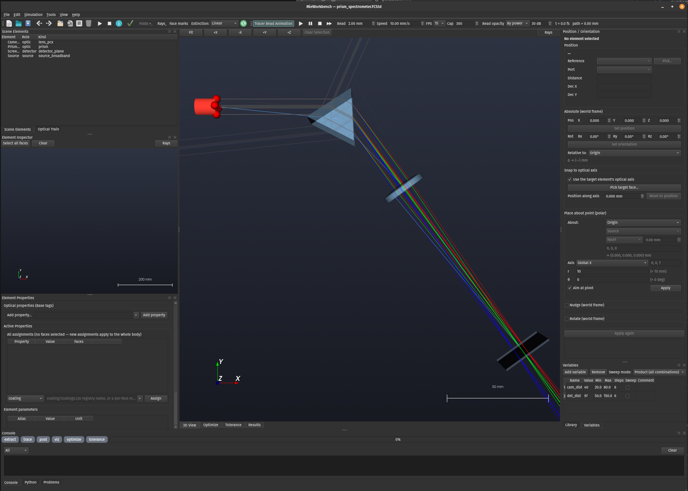

# MieWorkbench

MieWorkbench is a PySide6 GUI and orchestration layer built around an
existing FreeCAD-driven, physically-based coherent Monte-Carlo optical ray
tracer (referred to below as **the engine**). The engine itself — the
authoring contract for tagged `.FCStd` scenes, the physics model and its
honest limits, the optical-property CSV schemas, the full stage-by-stage
command reference, the 33-scene validation catalog, and troubleshooting —
is documented in **[docs/RAYTRACER.md](docs/RAYTRACER.md)**. This README
covers the workbench built on top of it: the desktop GUI, the headless
tools, the file formats it introduces (`.MieWB` / `.MieSim`), and how the
whole thing fits together.

See also: **[INSTALL.md](INSTALL.md)** (setup from a clone) and
**[CUSTOMIZE.md](CUSTOMIZE.md)** (authoring new optical elements and
property entries).

---

Screenshot:


## 1. What this is

The engine is a four-stage pipeline (permute → extract → trace → post →
viz) that turns a tagged FreeCAD `PartDesign` optical bench into detector
irradiance images, spectra, Stokes/polarization maps, an energy audit, and
3D/ParaView visualizations. It is driven entirely by `scripts/run_pipeline.py`
and a handful of stage scripts, each pinned to the right interpreter
(FreeCAD's embedded Python, a numpy/scipy/torch "optics env", ParaView's
`pvpython`, or plain system `python3`) — see docs/RAYTRACER.md §1/§2 for
the full picture.

MieWorkbench wraps that pipeline with:

- **A desktop GUI** (`mieworkbench/`, PySide6 + VTK) for building and
  editing tagged scenes visually — a 3D optical-train view with face
  picking, a library of parametric elements, a properties/tagging editor,
  a transform panel, a run-configuration dialog auto-generated from the
  real CLI, an **Optimize pane** and a **Tolerance pane** for driving the
  merit-function optimizer/tolerancer without touching the CLI, an
  in-app **Python console**, and a results viewer with ParaView handoff
  and live monitor mode.
- **Two new archive formats**, `.MieWB` (a portable, editable "workbench":
  scene + project property library + run configuration) and `.MieSim` (a
  self-contained, re-runnable result: the exact workbench used + its
  results), so a project can be handed to someone else — or to a headless
  server — as a single file.
- **A headless tool**, `scripts/miewb_tool.py`, that packs/unpacks/runs
  these archives without any GUI, for remote or CI use.
- **New parametric primitives** (`primitives/*.FCStd` + `.meta.json`, built
  by `scripts/primitivelib.py`) that the GUI's "Library" pane and "Add
  element" wizards use to drop pre-tagged lenses, mirrors, gratings,
  sources, etc. into a scene without hand-authoring FreeCAD geometry.
- **A merit-function optimizer and tolerancer** (`scripts/optimize.py`,
  `scripts/tolerance.py`, on the shared `scripts/fast_eval.py` evaluator)
  that drive spreadsheet design variables through local (scipy
  Nelder-Mead) or global (nevergrad CMA-ES) search, or through
  sensitivity + Monte-Carlo yield analysis with an optional nested focus
  compensator — see §5.14/§5.15 below.
- **Thermo-optic dn/dT and an 847-glass catalog** (`opticalproperties/materials.miemat`,
  imported from Zemax/OpticStudio AGF files via `scripts/tools/import_agf.py`),
  plus a `--temperature` run option and a per-body `temperature` tag for
  modeling a bench at other than room temperature.
- **Partial-coherence image simulation and exit-pupil Strehl** (`--image-sim`
  and friends, `--wavefront-pupil exit_pupil`) for convolving an input image
  through the modeled system's PSF and reporting a PSF-peak-ratio Strehl
  at the exit pupil instead of just the source-referenced one.
- **Scattering-instrument benches** (`sample` body property + the
  `sample/samples.miesamp` registry): a particle population bound to a
  liquid-fill cell's interior, with real inter-particle S(q) structure
  factors (Percus-Yevick/Baxter sticky-sphere/Teixeira fractal/powder
  paracrystal/tabulated, plus explicit fcc/bcc/sc lattice realizations)
  and orientation-averaged T-matrix spheroids for non-spherical particles.
  A traced dynamic-light-scattering (DLS) workflow (`scripts/run_dls.py` +
  `scripts/dls_correlate.py`) simulates a real Brownian frame sequence and
  correlates it back to g1/g2/D/hydrodynamic diameter. On the instrument
  side, a physical diode-array detector readout, a `--reference-case`
  UV-Vis absorbance product, and a `--ring-profile` log-annular sizer
  readout round out a laser-diffraction/spectrophotometer-style bench —
  see docs/RAYTRACER.md §5.13/§5.14/§8.7 and the 10 new sample-cell/lamp/
  image-source primitives (§3.6.2 below, catalog now 80 elements).

Everything the engine does — the physics, the tagging contract, the
optical-property registries — is unchanged; MieWorkbench only adds a UI
and some packaging around it. Command-line users who only want the
original engine pipeline can ignore this repo's GUI entirely and follow
docs/RAYTRACER.md directly.

## 1b. What this isn't

This is a physics-first ray tracer capable of handling some fairly complicated
physics including full Mie scattering, multiaxial birefringence and pulsed laser
sources down to modern femtosecond lasers.  This is by no means an exhaustive list.
It is capable of performing optical design and can look at real tollerances on optics
to help determine real-world performance of optical systems.  It is not
a commercial optical design studio nor is it as good as Zemax or other higher-end
commercial packages for optical design.  If you need that, then use one of the tried
and tested commercial packages.  Treat this program more as a 'virtual optical
workbench' than anything else.  It was designed physics-first for output that is as
close to testing something on a real optical bench as is possible.  The interface
itself works for the way I think, but it may not be as intuitive for someone else.
It is fully open-source so you are free to modify it however you would like to
make it work best for you.  

---

## 2. Quick start

Install first — see [INSTALL.md](INSTALL.md). Once `env/` exists and the
tool paths in `scripts/common.py` (or your `MIEWB_*` overrides / Settings
dialog) are correct for your machine:

```bash
# launch the GUI
env/bin/python -m mieworkbench
# or, if the launcher script has been installed (see INSTALL.md):
bin/mieworkbench

# open a specific file directly
env/bin/python -m mieworkbench example.FCStd
bin/mieworkbench example.FCStd

# or start from the demo gallery (see demos/README.md):
env/bin/python -m mieworkbench demos/newtonian.MieWB
python3 scripts/miewb_tool.py run demos/fiber_coupler.MieWB -o /tmp/out.MieSim
```

The **`demos/`** folder ships 42 ready-to-run `.MieWB` scenes (`ls
demos/*.MieWB | wc -l`) spanning the classic optical systems — beam
expander, Newtonian/Dobsonian/Schmidt-Cassegrain telescopes, Cooke
triplet camera, Lister microscope objective, Michelson interferometer,
Czerny-Turner and prism spectrometers, a ball-lens fiber coupler with
75 mm of TIR-guided step-index fiber — plus a pulsed-optics/time-domain
bench group. Each is a self-contained `.MieWB`
that completes on the quick preset; `demos/README.md` documents the
prescriptions (with citations) and `scripts/make_demos.py` rebuilds them
all through the GUI's own op path. Also in `demos/library_tests/`: nine
library-validation template scenes (`coated_plate_*`, `crystal_waveplate`,
`filter_plate`, `grating_plate`, `led_source`, `mat_*`, `polarizer_plate`)
with an automated sweep runner (`python3 scripts/run_library_tests.py`) for
end-to-end validation of every newly-added optical property (materials,
coatings, filters, polarizers, gratings, uniaxial crystals, detector QE curves).

Four more demos (`fizeau_flats`, `fs_shg_spectrogram`, `speckle_mie_combo`,
`quartz_rotator`) exist specifically to showcase physics a sequential ray
tracer cannot model at all — coherent multi-surface interferometry,
pulsed-SHG time-frequency dynamics, diffuser speckle + Mie-continuum
extinction, and gyrotropic optical activity; see the introduction to
`demos/README.md` for why each is out of reach of a sequential engine.

From the GUI: **File → Open…** and pick `example.FCStd` (a
divergent+collimated two-laser bench with a BK7 lens, a glass sphere, and
three detector screens — see docs/RAYTRACER.md §1). Then either:

- **Simulation → Run Pipeline…** to open the configuration matrix (§3.10
  below), pick the `quick` preset, and press **Run**; or
- **Simulation → Dry Run** for a fast estimate-only pass; or, from the
  command line, the same thing the GUI ultimately launches:

```bash
python3 scripts/run_pipeline.py --models example.FCStd --preset quick
```

This runs extract → trace → post → viz into `results/example/quick/` and
prints a summary table. Open the **Results** pane (or `File → Open…` a
finished case directory / `.MieSim`) to see detector images, spectra,
plots, and the energy-closure audit; the **Console** pane's stage chips
turn green as each stage completes. `docs/RAYTRACER.md` §4 documents the
exact output tree.

---

## 3. The UI tour

`mieworkbench/mainwindow.py`'s `MainWindow` is a Zemax-inspired shell:
a bottom-tabbed central `QTabWidget` (`central_tabs`) carrying the 3D
optical-train view plus the three big analysis surfaces — **3D View ·
Optimize · Tolerance · Results** — surrounded by dockable panes for
everything else (outliner, inspector, properties, transform, library,
console, problems), a menu/toolbar for file, simulation and view
actions, and three file kinds it can open — a bare `.FCStd` model (live FreeCAD session, edited in
place), a `.MieWB` workbench (exploded into a scratch workspace under
`var/work/`; **Save** re-packs the archive), or a `.MieSim` result (viewed
read-only, or opened via its embedded workbench for editing/rerun — a
successful rerun replaces the `.MieSim` in place).

> **Per-feature guides with screenshots:** [`docs/guide/`](docs/guide/README.md)
> has one terse, code-derived reference page per pane (plus system pages
> for the CLI/file formats/headless use), also reachable in-app from
> **Help →**. This section of the README stays a narrative tour; the
> guide is the page-per-feature lookup.

### 3.0 File menu and toolbar

**File → New** (Ctrl+N) creates a simulation from scratch: choose to start with
a **new `.MieWB`** (the default; creates a fresh workspace, seeds the project
property library from the system library, and packs the archive immediately) or a
bare **`.FCStd`**. `.MieSim` archives can never be created directly — they are
produced only by runs.

**Open**/**New** prompt to **Save / Discard / Cancel** when the current
model has unsaved changes. **File → Revert to Saved** (confirmation
required) discards every unsaved change by re-opening the model from its
last saved state on disk. **File → Close** (Ctrl+W) closes the session,
prompting the same way. Opening or closing a model always clears the
previous session's ray overlays, face selection and loaded results —
stale rays can no longer bleed into a freshly opened scene.

The **toolbar** is organized in logical groups: **New/Open/Save** | **Undo/Redo** |
**Add/Copy/Paste/Delete element** | **Run/Stop/Estimate** | **Validate** | **Fit view**
(plus a **Rays** menu for ray overlay controls and a **Face Orientation
Indicators** toggle, §3.1). Checked toolbar toggles (face indicators, ray
overlay, tracer-bead animation enable, …) all share one visibly distinct
highlight style — a translucent tint derived from the palette's Highlight
color, so a checked state reads clearly in both light and dark themes.
**Undo** (Ctrl+Z) / **Redo**
(Ctrl+Shift+Z) support up to ~20 levels of history covering property edits, parameter
edits, element moves, and add/paste/delete operations — undo stashes live in the
workspace directory.

### 3.1 Central 3D optical-train viewport (`panes/scene3d.py`)
*Guide: [viewport-3d.md](docs/guide/viewport-3d.md)*


The **"3D View"** tab — the first tab of the central `QTabWidget`
(`central_tabs`, §3 above), and still the tab that opens by default.
Shows every body in the scene in one shared 3D view. Toolbar: **Fit**
(reframe the whole scene), four
axis-view buttons (**+X/−X/+Y/+Z**), a **Clear selection** button, and a **Rays** menu (show/hide the loaded ray
overlay, reload, or launch **Live ray preview…**). This view selects **whole
elements only**: clicking **any** face of **any** member body of a
multi-body element highlights every member's faces (not just the body
that was hit) and routes the selection to the Element Inspector and
Element Properties panes — building up a multi-face selection is
exclusively the Element Inspector's job (§3.3), so the two 3D views can't
fight over what's picked. Sub-selecting one member body of a multi-body
element is done elsewhere — an outliner child row, or the Inspector/
Element Properties member list (§3.2–3.4) — never by clicking here.
Clicking a different body always replaces the selection; **Clear
selection** (the toolbar button, **Esc**, or **Edit → Clear Selection**)
deselects everything, and selection-dependent actions (Copy, Delete, the
Transform panel's operations) disable automatically when nothing is
selected. Standard VTK trackball-camera mouse controls (drag to rotate,
scroll to zoom).

An adaptive **scale bar** (2D overlay) appears in the lower-left corner: 1-2-5-snapped
to 20–30% of viewport width, labeled in mm and switching to µm below 2.5 mm,
updated every render as the zoom changes.

Bodies are colored by **role**, resolved from their tags: a body with
both `power` and `lambdac` set is a **source** (red-ish, opaque); a body
with `material == "detector"` is a **detector** (gray-blue, translucent);
everything else is an **optic** (glassy light blue, translucent). A
selected face is highlighted orange with edges shown. (This color mapping
exists as a style table in the code; there is no separate on-screen
legend widget.)

**Ray displays**: a finished run auto-loads `viz/rays.vtp` as a 3D overlay.
The **Rays** menu offers **show/hide**, **reload**, or **Live ray preview…**, which traces
a small deterministic fan (center + top/bottom/left/right of each source's emit face,
count adjustable) through the current scene without running a full simulation. This
includes divergent (spherical-cap) laser sources — the fan/rings pattern generates in
the emit cap's rim plane and lifts onto the curved cap with per-point normal directions,
so a diverging-laser scene previews correctly instead of silently producing zero rays —
and scenes with no detector yet, where preview_rays injects a synthetic transparent
far-field detector behind the scenes so the trace can still run. Simply **checking the
Rays toggle** with nothing currently shown does something useful too: it loads the last
run's `viz/rays.vtp` if a finished case is open, and otherwise offers the live preview
directly. The preview pattern — **Fan** (rays per source) or **Rings**
(spacing/rays-per-ring/ring count) — and which **trace engine** runs it
(below) are both set in the consolidated **Preview Configuration** dialog
(`panes/previewdialog.py`), opened from **Live ray preview…** itself, or
from **Simulation → Simulation Settings… ▸ Ray Preview** / **File →
Settings… ▸ Defaults** (both are now pointer pages into the same dialog).
Pattern and engine persist **per document** (`Project.set_preview_config`,
travels with the `.FCStd`/`.MieWB`); with no per-document config they
fall back to this install's last-used values (QSettings), then the app
defaults of a 5-ray fan on the Full-trace engine.

Both preview and rendered rays are **colored by wavelength** (each segment
carries a CIE-derived RGB from its source λ), so chromatic dispersion and
diffraction orders read directly off the overlay. Edits that affect the
optics grey the ray ACTORS out (low-opacity gray, plus a "Rays (stale)"
button label) until fresh rays load.

**Ray extinction / dimming** (View ▸ *Ray Dimming*, the toolbar's
**Extinction:** combo, or the Preview Configuration dialog's *Overlay
display* section — all three drive the same state, off by default,
persisted): fades each ray segment by attenuation — for Linear/
Perceptual, opacity is the segment's remaining power relative to its own
ray's power at the source (P/P₀), so absorption, coatings, and Fresnel
splits all dim the trace consistently (a 50/50 beamsplitter yields two
half-opacity arms). Four modes: **Off**; **Linear** (opacity = P/P₀,
fading fully to invisible at zero power); **Perceptual** (√(P/P₀),
compensating the eye's nonlinearity); and **Logarithmic (dB)** (default
dynamic range 30 dB, presets 30/40/60 dB or a custom 1–120 dB value — a
segment R dB below the source renders at opacity = 1 − R/range, so a
~14 dB/reflection uncoated Fresnel ghost stays visible at 40 dB). A
**Minimum Opacity…** floor keeps heavily attenuated rays faintly
traceable in any mode.

**Trace engine** (also in the Preview Configuration dialog): **Sequential**
runs the on-axis Optiland fast path (primary transmitted chain only, no
reflections, exact bead timing) — the same interactive/paraxial engine
used for on-axis preview and, via `--eval-backend sequential`, for
Optimize/Tolerance evaluation (§5.14/§5.15); **Full trace** (the default)
forces the real Monte-Carlo preview subprocess with Fresnel ghost
children (6-bounce cap, standard weak-ray power floor). Switching to
Full trace while extinction is Off auto-selects Logarithmic, since Full
trace's 20–40 dB-down ghosts would otherwise render at full opacity; an
explicitly chosen Linear/Perceptual mode is left alone. The nonsequential
coherent Monte-Carlo trace is the engine every real run and result is
computed with — Sequential/Optiland is a preview and optimizer-evaluation
convenience, never a substitute analysis path.

Both preview and rendered rays are dimmed identically in both 3D views;
`rays.vtp` files from runs predating the feature simply render undimmed.
The rendered pipeline outputs (`rays_xy.png`, the 3D viz renders) have
the equivalent `--dim-rays {off,linear,sqrt}` / `--dim-rays-floor PCT`
options in the run config panel and `run_pipeline.py` — the Logarithmic
mode is currently GUI-preview-only, not a rendered-output option.

*Guide: [animation.md](docs/guide/animation.md)*

**Tracer-bead animation** (View ▸ *Tracer Bead Animation*, off by
default, persisted): rides a photon-bunch bead along each ray at its true
physical speed — c in vacuum, c/n inside glass, so beads visibly slow
down in denser media — and spawns a child bead at a reflection/
transmission split at the instant the parent bead reaches it. A dedicated
Animation toolbar carries the enable toggle, Play/Pause/Stop/Step
transport, a Bead size (mm) spinbox, a Speed (mm/s, default 2 mm/s of
vacuum-equivalent path per real second) spinbox, an FPS combo
(5/10/15/24/30, default 15), and a **Cap** spinbox (max animated rays per
source, default 300 — since viz segments carry no ray id, this is a
render cap, not a trace cap; in **By power** opacity mode it keeps the
brightest + leading-wavefront beads per source rather than the first N);
a live readout shows `t = <auto-scaled fs/ps/ns/µs/ms>` and the
corresponding vacuum-equivalent path in mm. Play loops at the latest
ray's arrival time until Stop, which rewinds every bead to the sources;
Step advances exactly one frame. Beads are colored by each ray's
wavelength and stay fully opaque regardless of Ray Dimming — extinction
never fades the beads themselves. Enabling animation is **self-sufficient**:
if there's nothing to animate yet (no overlay, or a stale one), it
generates a fresh ray preview automatically and parks the beads paused
at t = 0 the instant it lands — including on on-axis (sequential/
Optiland) systems, whose preview path now carries the same per-segment
optical-path timing data as a full run. These same enabled/bead-size/
speed/fps/cap values live in the **Preview Configuration** dialog
(above); the tabbed **File ▸ Settings…** dialog's **Defaults** tab is now
a pointer page that opens it, rather than editing them directly.

**Auto-updating preview** (View ▸ *Auto-update Ray Preview*, on by
default, persisted): about a second after the last optics-affecting edit
(geometry moves/reshapes, element add/delete, any contract-property
change — GUI-internal bookkeeping doesn't count), the preview fan
re-traces in the background and replaces the stale overlay. Edits made
while a preview is running queue exactly one follow-up run; a running
full pipeline is never competed with.

**Face-orientation indicators** (View ▸ *Face Orientation Indicators* —
also a toggle on the main toolbar, sharing the checked-highlight style
described in §3.0 — on by default, persisted): purely visual glyphs in
both 3D views showing
which way each element faces — a **red half-disc** on a source's emission
face and a detector's recording face (the same closest-to-origin face the
extractor auto-picks; spherical emitters are skipped), a **green dot** on
the local +x face of apertures (slit/iris/pinhole) and a **blue dot** on
the local +x face of every other traced optic. They are never written to
the model and never traced.

### 3.2 Scene Elements outliner (`panes/outliner.py`)
*Guide: [outliner.md](docs/guide/outliner.md)*


Dock **"Scene Elements"** — a tree listing every element in the scene by name,
role (source/detector/optic/ignored), and primitive kind. Multi-body elements
(groups tagged `miewb_group`) collapse into one top-level row with member bodies
as children. **Click** the top-level row to select the whole element in the 3D
view (synced bidirectionally); **click a child row** to explicitly sub-select
just that one member body; **double-click** to open the Element Properties editor; **Del** key deletes;
**context menu** offers **Copy**, **Paste** (duplicates the element under a unique label,
offset in +X to avoid overlap), and **Delete**. Copy/paste/delete each count as
a single undo step.

### 3.3 Element Inspector (`panes/inspector3d.py`)
*Guide: [inspector.md](docs/guide/inspector.md)*


Dock **"Element Inspector"** — a single-element 3D view showing only the
currently selected body, centered and camera-fit. This is the primary
surface for building up a face selection to hand to the Element
Properties pane (the central viewport can also pick faces, but this pane
is where multi-face selections are expected to be built). Buttons:
**Select all faces**, **Clear**. Plain click replaces the face selection;
**Shift+click extends** (always adds, never removes); **Ctrl+click
toggles** membership. A **right-click** anywhere in the view pops the
same **Active Properties** menu as the Element Properties pane (§3.4):
apply or remove per-face properties on the current selection without
leaving the 3D view (this pane trades VTK's right-drag zoom for the menu;
the scroll wheel still zooms). A **Rays** toggle (like the main viewport)
traces a preview fan through just the inspected element, useful for checking a
single component's behavior in isolation. Rotating is the standard VTK trackball
interactor, not a dedicated control. When the selection is a multi-body
element (or nothing at all), the 3D view is replaced by a neutral state —
an "Element *Name* — *N* bodies" hint over a clickable member list; click
a member to sub-select and inspect that one body.

### 3.4 Element Properties (`panes/element_editor.py`)
*Guide: [element-editor.md](docs/guide/element-editor.md)*


Dock **"Element Properties"** — edits the selected body's tagging
contract, per-face assignments, and parameter-sheet aliases, entirely
through the in-memory Project (never talking to FreeCAD directly). A
multi-body element (or an empty selection) blanks all three sections for
the same clickable member-list neutral state as the Element Inspector
(§3.3); a single-body element edits normally. Three sections:

- **Optical properties (Base tags)** — one row per non-internal custom
  property on the body (internal `miewb_*` bookkeeping tags are hidden),
  plus **Add property…**. The full contract property set is `material`,
  `power`, `lambdac`, `lambdamin`, `lambdamax`, `coherent`, `polarization`,
  `coating`, `roughness`, `filter`, `polarizer`, `polarizer_axis`,
  `crystal_axis`, `grating`, `surface_override`, `mirror`, `absorbance`,
  `temperature` — see §5 below and docs/RAYTRACER.md §5.1 for full
  semantics of each.
  New properties default to sensible values (never empty: e.g., `power`
  defaults to 5.0 mW, `lambdac` to 633 nm, registry properties to a
  well-known library entry) and show inline unit labels (e.g.,
  "power [mW]", "lambdac [nm]") for clarity.
- **Active Properties** — the per-face assignments, organized by
  ASSIGNMENT rather than by face: one row per `(property, value)` pair
  (`coating` / `roughness` / `diffuser` / `grating` / `surface_override`,
  the five properties supporting a per-face map like `'Face3=MgF2'`),
  showing **Property | Value | Faces | Remove**. The **Value** cell is a
  registry-fed dropdown (coatings/gratings/diffusers come from the active
  property library — the project's embedded one when a `.MieWB` is open;
  roughness offers presets; everything stays hand-editable as the escape
  hatch). The **Faces** cell lists the covered faces (`Face1, Face3` or
  `whole body`, with the source/detector working face marked `(emit)` /
  `(detector)`) and clicking it opens a per-face **checkbox menu** to add
  or remove faces from that assignment with zero typing. With faces
  selected (3D picks or assignment rows), the table **filters** to
  assignments touching the selection; selecting an assignment row
  highlights its faces in the Element Inspector ("show me where that
  coating is"). A **right-click** (here or in the inspector's 3D view)
  opens the **Active Properties menu**: property → value tree with a
  checkmark when the value is on every selected face (click to remove it
  there), italics when it's on some of them (click to complete the
  coverage), plus a `Custom…` entry per property. With no face selection,
  menu and Assign row target the whole body. Hand-typed values are still
  validated against the contract grammar **and** the body's real face
  count before committing — a bad `FaceN=` shows a red warning instead of
  silently writing something the extractor would later reject. Grating
  assignments never collapse to the whole-body shorthand (the contract
  requires explicit faces).
- **Element parameters** — the parameter-sheet ("dim spreadsheet") editor:
  one row per aliased cell (`Alias` / `Value` / `Unit`), parsed from and
  recomposed back into the raw `"=<value> <unit>"` cell form. If the body
  is a library primitive (carries a `miewb_primitive` tag), committing an
  edit also triggers a rebuild of its geometry from the primitive builder
  (see CUSTOMIZE.md — geometry parameters can change topology, so they
  aren't driven by ordinary FreeCAD expressions).

### 3.5 Position / Orientation (`panes/transform_panel.py`)
*Guide: [transform.md](docs/guide/transform.md)*


Dock **"Position / Orientation"** — translate and rotate the selected
element with repeatable operations. Reference points resolve *live* at
apply time, so "Apply again" after other moves keeps its meaning (e.g.
"toward the lens"). Reference-point kinds: **Origin**, a **fixed point**
you type in, or one of three element-relative points (**optical center**,
**center of mass**, **bbox center**, **point on face normal**).

- **Translate**: X/Y/Z offset + **Apply translation**; or pick a
  reference point, a distance (default 10 mm, negative moves away), and
  **Move toward**.
- **Rotate**: axis (Global X/Y/Z, a custom vector, or the selected
  element's own optical axis) + angle (±360°) + an "About:" reference
  point + **Apply rotation**.
- **Apply again** re-applies the last operation, re-resolving any
  reference points at their current positions; a log lists every
  operation applied this session. If a body's placement is itself
  spreadsheet-driven, the panel says so and routes the move through the
  driving expression instead of silently fighting it.
- **Absolute (world frame)**: the selected element's world position
  (X/Y/Z mm) and orientation (intrinsic X-Y-Z Euler angles Rx/Ry/Rz,
  degrees), live-updated as it moves. Edit the fields and **Set
  position** / **Set orientation** to jump it to an exact pose. A
  **Relative to:** selector shows the element's optical-center offset from
  the Origin (default) or from any other element's optical center.
- **Snap to optical axis**: **Pick target face…**, then click a face in
  the 3D view. The selected element rotates so its optical axis aligns
  with the target (the target element's optical axis when *Use the target
  element's optical axis* is checked, else the exact face normal you
  clicked) and slides sideways onto that axis line — preserving its
  along-axis distance — in a single undo step. It then enters a
  **drag-along-axis** mode: move the mouse to slide the element up and
  down the beam (a left click commits, **Esc** cancels), or type an
  **along-axis offset** and **Apply offset** for an exact shift. This is
  the fix for the folded-beam placement pain (e.g. dropping an iris onto a
  prism's deviated beam without hand trig).

A compact **Positioning** readout at the top of the panel shows whether
the selected element is **anchored** (absolute pose) or **chained** into
the optical train, with one-click Chain…/Anchor-here conversion.

### 3.5.1 Optical Train (`panes/train_editor.py`)
*Guide: [train-editor.md](docs/guide/train-editor.md)*


The LDE-style editable view of the scene as an **optical train**: every
element is either anchored or chained a **vertex-to-vertex distance
down the beam** from a reference element's exit port. One indented tree
shows the whole train — beamsplitter arms nest under port rows
(`transmit ↓` / `reflect ↳`), fold mirrors carry a folded/unfolded
checkbox, and every numeric cell (distance, decenter, tilts) accepts
**variable expressions** (`arm2 + screen_arm`) displayed with their
evaluated value. Chaining is click-driven: select the new element,
**Pick reference in 3D**, click the upstream element. Ports are a combo
(transmit/reflect/deviate — gratings and prisms redirect by their
deviation fields, not the mirror law), `flip` turns a lens end-for-end,
and right-click offers Mark-as-fold / edge details (rotation order,
pivot, deviate fields). Editing anything **ripples the whole downstream
train rigidly in one undo step**; unfolding a fold straightens its
downstream arm onto the incoming axis (path lengths preserved), ghosts
the mirror in the viewport, and **excludes it from the simulation**;
refolding restores bit-exactly. Dotted blue/orange linkage lines in the
3D view trace the chain; File → Export FCStd writes a standalone copy
in the current fold state that opens in plain FreeCAD.

### 3.5.2 Variables (`panes/variables_pane.py`)
*Guide: [variables.md](docs/guide/variables.md)*


The **global variables** table (stored in the model's `miewb_vars`
spreadsheet, so files stay standalone): name, value (expressions over
other variables allowed — `+ - * / ( )`, the constant `pi`, and math
functions `sin cos tan asin acos atan atan2 sqrt abs radians degrees`;
**trig takes/returns degrees** to match the tilt fields, with
`sinr`/`cosr`/`tanr`/… radian variants; cycles detected and named),
sweep min/max/steps, and a per-row **Sweep** enable. Variables are usable in train
fields, in element dimensions (FreeCAD expression
`=<<miewb_vars>>.name * 1mm` — the iris opening in the camera_triplet
demo works this way), and in float body properties via
`miewb_expr_<prop>`. Editing a value re-solves the train and rebuilds
any referencing primitives, one undo step. With sweeps enabled, Run
Pipeline launches the **product or zipped** variant grid — always after
a summary dialog showing the run count and calibrated time estimate.

### 3.5.3 Compare (`panes/compare_pane.py`)
*Guide: [compare.md](docs/guide/compare.md)*


Populates automatically when a sweep finishes (or via **Add case…** for
any finished runs, e.g. michelson vs michelson_folded): scalar
**metric-vs-variable plots** (detected power, peak irradiance, fringe
visibility, centroid, RMS spot radius), a shared-scale detector-image
gallery labeled by variable values, **signed difference maps** against a
selectable reference variant, and a scrub slider through the sweep.
Backend: `scripts/compare_sweep.py` under the optics env.

### 3.6 Library (`panes/library.py`)
*Guide: [library-browser.md](docs/guide/library-browser.md)*


Dock **"Library"**, three tabs:

- **Elements** — a tree of `primitives/*.FCStd`, grouped by category
  (Sources, Lenses, Mirrors, …). **Refresh** rescans the directory (drop a
  hand-authored `.FCStd` in and it appears); **Add to scene** (or
  double-click) opens the **element wizard** on the selected primitive
  (below) instead of just prompting for a label.
- **Project library** / **System library** — summary tabs showing category titles
  with entry counts (e.g., "Coatings (39)", "Gratings (9)"); **double-click**
  a row opens the Property Library Editor at that category (CUSTOMIZE.md).

Two libraries live on disk: the **system library** is `<repo>/opticalproperties/`
and `<repo>/primitives/` (read by default; only written to by an explicit,
validated "promote to system" action); the **project library** is
`<project>/opticalproperties/` inside a `.MieWB` workspace — a
possibly-partial copy holding just the registry rows and table/nk files a
given model actually uses, so a project directory (or a `.MieWB`) is
self-contained and can be traced elsewhere with
`--optical-properties <project>/opticalproperties`.

### 3.6.1 The element wizard (`panes/element_wizard.py`, `panes/wizard_dialog.py`)

`ElementWizardDialog` is how every primitive gets added or re-customized —
it configures the whole element, not just its geometry:

- A **geometry table** (Name / Value / Unit) prefilled from the
  primitive's `dim`-sheet defaults, one row per parameter; the
  `round_flag` convention (§3.6.2 below; CUSTOMIZE.md §3 for how it's
  built) renders as a **"Circular shape" checkbox** instead of a bare 0/1
  number, on every plate and source primitive that has one.
- A **Device Properties** form below it, built from the primitive's baked
  contract tags: **sources** expose `power` / `lambdac` / `coherent` /
  `polarization` (+ `lambdamin`/`lambdamax` for broadband sources);
  **detectors** expose `mirror` (reflectivity) and `absorbance`; **optics**
  expose whatever registry-backed tags they bake in (`material`,
  `coating`, `filter`, `polarizer`, `grating`, …) as combo boxes populated
  from the live optical-property library, plus any plain float/bool/string
  tags as ordinary editors.
- Lens primitives that have a matching `LENS_FORMS` entry additionally get
  a **"Design by focal length"** box (§6 of CUSTOMIZE.md).
- A **Preview** button builds/rebuilds the element live in the 3D view
  while the dialog stays open, so parameter and property changes can be
  eyeballed before committing; **Cancel** rolls the preview back out via
  the same undo macro used for a real add (nothing is left behind).
- **Add element** (toolbar/menu, or the keyboard shortcut) opens a
  **type-first** flow when nothing is selected in the Library: choose
  *what* you want (Light source / Detector / Optical element / Generic
  solid — each with an explanation), pick *which* primitive from the
  filtered list, then **Configure…** opens the same wizard dialog above.
- **Double-clicking an element in the Scene Elements outliner** reopens
  this same wizard prefilled from the element's current parameter-sheet
  values and body properties (`ElementWizardDialog.for_element`) — **Apply**
  diffs the new values against the current ones and writes only what
  changed, in one undo step. Hand-authored (non-primitive) bodies instead
  fall back to focusing the Element Properties pane, since there's no
  primitive spec to drive a wizard from.

### 3.6.2 Primitive catalog (80 elements)

Every entry below is one `primitives/*.FCStd` + `.meta.json` pair, built by
`scripts/primitivelib.py`'s `PRIMITIVES` registry (CUSTOMIZE.md §§1–3).
Dimensions are diameters/widths, never radii/half-sizes (§3.6.1); `round_flag`
(present on every plate-like and source primitive) picks circular vs.
rectangular. The Library's "Elements" tab groups them exactly by these
category strings; the type-first Add flow's "Generic solid" role is a
reserved slot in the chooser with no primitives in it yet.

**Sources** — `laser_collimated` (diameter, length, round_flag: collimated
beam off a flat +x end cap); `laser_divergent` (diameter, roc, length,
round_flag: convex spherical emit cap so rays diverge from a virtual
point — round form only, the rectangular form is a flat emitter and roc
doesn't apply); `source_broadband` (diameter, length, round_flag:
incoherent broadband disc/box emitter, set `lambdamin`/`lambdamax` in the
properties), plus 8 monochromatic LEDs (`led_deep_red_660`/`led_red_630`/
`led_amber_590`/`led_green_525`/`led_blue_470`/`led_royal_blue_450`/
`led_uv_365`/`led_uv_385`) and a `led_white`, and 6 pulsed/supercontinuum
sources for the time-domain/NLO demo group (`laser_pulsed`,
`laser_maitai_800`, `laser_erfiber_1560`, `laser_ndyag_1064`, `sc_superk`,
`fiber_nonlinear_output`); `tungsten_halogen`/`d2_lamp`/`hg_calibration`
(the samples-instruments round's three new lamp emission rows — blackbody,
tabulated UV continuum, and NIST-cited line-spectrum sources
respectively) and `source_image` (a Lambertian USAF-style-target image
emitter, `image`/`image_cone_deg` properties, §5.14 of docs/RAYTRACER.md).

**Detectors** — `detector_plane` (width, height, thickness, round_flag:
thin transparent screen, its −x face records irradiance; height 0 = the
legacy square shape, height > 0 gives a true rectangle — e.g. a
36 × 24 mm full-frame CMOS sensor; the detector grid derives the
non-square pixel layout from the face bbox automatically).

**Fiber Optics** — `fiber_optic` (core_diameter, clad_diameter, length,
gap: straight step-index multimode fiber along +x — analytic-cylinder
core + concentric cladding annulus with flat polished ends; defaults
model a 200 µm-core 0.22-NA silica fiber via the `fiber_core_na22`
material row against a `fused_silica` cladding, swap either body's
`material` to change the NA; the core/clad boundary uses the standard
5 µm modeling air gap, so guided rays inside the NA TIR exactly as they
should while leaky/cladding-mode power is not quantitative; two bodies).

**Lenses** — `lens_pcx` plano-convex (R_front, ct, aperture);
`lens_dcx` biconvex (R_front, R_back, ct, aperture); `lens_pcv`
plano-concave (R_back, ct, aperture); `lens_dcv` biconcave (R_front,
R_back, ct, aperture); `lens_meniscus` (R_front, R_back same sign, ct,
aperture); `lens_ball` (diameter: full sphere); `lens_rod` (diameter,
length: cylinder rod, axis z); `lens_cyl` (R signed, ct, aperture,
height: line focus); `lens_asphere` (R, k conic constant, ct, aperture:
revolved exact-sag BSpline + `surface_override`, extractor-verified
<1 µm); `lens_fresnel` (aperture, f_design, n_design, n_facets, back:
collapsed annular-facet plano-convex); `lens_achromat` (R_front, R_iface,
R_back, ct_crown, ct_flint, gap, aperture: cemented crown+flint doublet,
two bodies, 5 µm interface air gap); `axicon` (base_angle, aperture:
conical front, turns a beam into a ring/Bessel zone).

**Prisms & Mirrors** — `prism` equilateral dispersing prism (side, height,
rotation); `mirror_flat` (width, thickness, round_flag: aluminum; combine
with `mirror`/a coating for partial reflectors); `prism_right_angle`
(leg, height: 45-45-90, hypotenuse TIRs the beam 90°); `prism_wedge`
(diameter, thickness, wedge_deg: angular deviation, no reflection);
`prism_dove` (aperture, length: image-rotation prism, TIRs once off the
long face); `prism_penta` (aperture: 90° deviation regardless of prism
orientation, no image reversal — the two reflecting faces don't satisfy
TIR in bk7 so they carry a real Al mirror coating); `prism_rhomboid`
(aperture, length: lateral beam displacement, direction/orientation
preserved); `mirror_concave` (R, aperture, ct: front-surface spherical,
converging, aluminum); `mirror_convex` (R, aperture, ct: front-surface
spherical, diverging, aluminum); `mirror_d_shaped` (diameter, thickness,
cut_offset: circular mirror with one flat edge for close beam-packing);
`retro_corner_cube` (aperture: solid glass trihedral corner-cube, returns
any incoming ray antiparallel to itself); `anamorphic_pair` (wedge_deg,
aperture, separation: two bodies, magnifies the beam in y only, net
deviation cancels); `mirror_parabolic` (rfl, aperture, thickness:
front-surface, exact on-axis paraxial and geometric focus — see the note
below); `mirror_annular` (R, aperture, hole_diameter, ct: center-holed
spherical concave mirror — a Cassegrain/SCT-style perforated primary; the
hole is a genuinely open revolved annulus, not a plugged aperture stop).

**Plates & Filters** — `window` plane-parallel plate (width, thickness,
round_flag); `filter_plate` bulk spectral filter (width, thickness,
round_flag, default filter `bp_550_40`); `grating_plate` (width,
thickness, round_flag, front-face grating spec, default 600 l/mm
vertical); `window_wedged` (width, thickness, wedge_deg, round_flag:
tilted back face kills etalon fringes).

**Polarization** — `polarizer_plate` (width, thickness, round_flag,
polarizer registry row + `polarizer_axis`); `waveplate` quartz retarder
(width, thickness — sets retardance, round_flag, `crystal_axis`);
`pbs_cube` (cube, height, plate_ct: a single BK7 cube with a thin
`pbs_visible_45`-coated plate NESTED inside along the diagonal —
glass-glass interface, s-pol reflects/p-pol transmits; two bodies);
`polarizer_glan_taylor` (aperture, length, gap, cut_angle: two
calcite prisms — the o-ray TIRs at the internal air gap and is rejected
sideways while the e-ray transmits straight through, extinction via TIR
not absorption).

**Beamsplitters** — `bs_plate` non-polarizing 50:50 (width, thickness,
round_flag, wedge_deg; front face default `bs_5050_vis_45`); `pbs_plate`
polarizing (width, thickness, round_flag; front face `pbs_visible_45`);
`dichroic_plate` (width, thickness, round_flag; default
`dichroic_567lp_45`, swappable to `hot_mirror_45`/`cold_mirror_45`);
`pellicle` (diameter, membrane_thickness; ultra-thin membrane, front face
default `pellicle_4555_45`, swappable to `pellicle_uncoated_45`);
`bs_cube` (cube, height, plate_ct: a single BK7 cube with a thin coated
plate NESTED inside along the diagonal — the glass-glass interface makes
the split table apply exactly; the earlier two-prism 5 µm-gap build
TIR'd the transmitted arm at 45° and lost ~⅓ of the power to seam loss.
Default `bs_5050_vis_45`; validated 46.7 %/43.4 % arms, zero seam loss).

**Filters** — `nd_filter` absorptive (width, thickness, round_flag,
default filter `nd_od10`); `nd_reflective` metallic (width, thickness,
round_flag; front face default coating `nd_refl_od10`); `filter_bandpass`
(default `bp_550_40`, CWL 550 nm/FWHM 40 nm); `filter_longpass` (default
`longpass_600`, cut-on 600 nm); `filter_shortpass` (default
`shortpass_600`, cut-off 600 nm); `filter_notch` (default `notch_633_25`,
OD4 notch at 633 nm, 25 nm FWHM).

**Diffusers** — `diffuser_plate` (width, thickness, round_flag; exit face
carries the ground-surface scatter, default `@dg_600`) — see §3.6.3 below.

**Apertures** — `iris` circular stop (outer_diameter, thickness,
hole_diameter, blackness: opaque annular disc + a `material=air` plug
filling the opening); `pinhole` (width, height, thickness, hole_diameter,
blackness: small circular pinhole in a blackened rectangular plate + air
plug); `slit` (width, height, thickness, slit_width, slit_height,
blackness: rectangular slit opening + air plug); `iris_bladed`
(outer_diameter, thickness, aperture_diameter, n_blades, blackness:
N-blade true-polygon iris — the polygonal opening produces an N-fold
coherent diffraction star instead of an Airy ring). All four follow the
air-filler aperture contract (docs/RAYTRACER.md §5.10); `blackness` drives
the plate/disc's `absorbance` property directly through the
`derived_props` mechanism (CUSTOMIZE.md §1) — it is re-derived on every
rebuild, so editing `absorbance` by hand would just be overwritten.

**Samples & Cells** (samples-instruments round) — `cuvette_square`/
`cuvette_capillary`/`flow_cell` (nested glass-wall + liquid rectangular
cells, the `bs_cube` exact-containment pattern); `vial_cylindrical` (DLS
vial) / `vat_cylindrical` (decalin index-matching bath); `sample_region`
(a bare `material=air` anchor cube, chain-referenceable via its own
`port_frames` entry, for an unwalled particle cloud). All are hosts for
the `sample` body property (§5.13 of docs/RAYTRACER.md) — a particle
population with an optional S(q) structure factor or T-matrix spheroid
shape bound to whichever cell's interior.

**Swapping registry variants without changing geometry**: many of the
plate primitives above default to one row of a larger registry family and
can be pointed at a sibling row purely through the Element Properties or
wizard Device Properties dropdown — no geometry rebuild needed. Beamsplitter
ratio: any `bs_XXYY_vis_45` row (`bs_1090`/`3070`/`4060`/`5050`/`6040`/
`7030`/`9010_vis_45`) on `bs_plate`/`bs_cube`'s `coating` property.
Neutral density: any `nd_odXX` row on `nd_filter`'s `filter` property, or
`nd_refl_odXX` on `nd_reflective`'s `coating`. Diffuser grit: any `@dg_120`/
`@dg_220`/`@dg_600`/`@dg_1500` reference on `diffuser_plate`'s `diffuser`
property (coarser number → finer grit → narrower scatter angle).

**`mirror_parabolic` note**: this is an **on-axis** parabolic mirror only
(conic k=−1, R=2×rfl) — exact paraxial *and* geometric on-axis focus, using
the same revolved exact-sag-BSpline + verified `surface_override` technique
as `lens_asphere`. An **off-axis** parabola (OAP) is not supported: the
extractor's asphere vertex locator requires the retained face to include
the r≈0 vertex, which a 90°-off-axis segment structurally never does — this
is a limitation of the surface-verification step, not the physics, and is
documented in the primitive's own tooltip.

### 3.6.3 Diffusers (B6)

`diffuser_plate` (and the `diffuser` body property in general — any
primitive's face can carry one) declares a ground-glass scattering
surface with grammar `'grit:120'` | `'slope:0.08'` | `'@dg_600'`, whole-body
or per-face (`'Face2=@dg_600'`); the registry (`opticalproperties/diffuser/
diffusers.miedif`) ships `dg_120`/`dg_220`/`dg_600`/`dg_1500` rows
(coarser grit number → finer surface → narrower scatter cone). By
convention the ground surface goes on the **exit** face of a plate (the
shipped `diffuser_plate` puts it on the back/+x face). `diffuser` and
`roughness` are **mutually exclusive on the same face** — declaring both
is a validation error, both in the GUI's pre-run checks and in the engine's
own scene build. The physics (deep-rough Beckmann limit, grit→slope
calibration, honest single-scatter limits) is documented in
docs/RAYTRACER.md §5.4.1.

### 3.7 Console, stage chips, progress (bottom dock, `panes/console.py`)
*Guide: [console-and-problems.md](docs/guide/console-and-problems.md)*


One colored pill per pipeline stage (`extract`/`trace`/`post`/`viz`: blue
= running, green = done/estimated, red = failed, gray = not yet run), an
overall progress bar, and a dark, monospace console log fed line-by-line
from the running pipeline subprocess (an in-memory ring buffer of the last
20000 lines). A stage filter combo and a **Clear** button (does not stop a
running pipeline); lines are colorized by stage and severity (errors red,
notices orange). Internal `@MIEWB {json}` progress lines are consumed to
drive the chips/progress bar rather than being printed raw.

### 3.7a Python console (bottom dock, `panes/py_console.py`)
*Guide: [console-and-problems.md](docs/guide/console-and-problems.md)*


Dock **"Python"** (tabbed with the Console at the bottom) — an in-app REPL
bound to the live session: `project` (the `core.project.Project` object),
`window`, `runner`, and `np` are in scope, so you can query and script the
scene programmatically (`project.body_names()`, `project.set_property(...)`,
`project.undo()`, …). Every `project` mutation flows through the same
undoable Command path as the GUI, so console edits get undo/redo for free.
Stdlib-only (`code.InteractiveConsole`), with Up/Down command history and
Tab completion over the live namespace; statements run synchronously on the
GUI thread (a long statement briefly blocks the UI — there is no separate
kernel process).

### 3.7b Optimize (`panes/optimize_pane.py`)
*Guide: [optimize.md](docs/guide/optimize.md)*


The **"Optimize"** central tab (also reachable via **Simulation →
Optimize…**, which switches to it) — full GUI parity with
`scripts/optimize.py` (§5.14): a **variable table** (name/start/lo/hi),
where the name cell is an editable dropdown populated from the scene's
`miewb_vars` (picking one auto-fills start/bounds; typing an arbitrary
dim-sheet alias still works); a **merit-operand table**
(operand/detector/target/weight, operand cell a dropdown over
`cli_specs.OPTIMIZE_OPERANDS` — `spot_rms`/`focus`, `encircled_energy`,
`mtf50`, `detected_power` — or any raw flattened `report.json` key);
an **algorithm** combo (`local` = scipy Nelder-Mead, `global` =
nevergrad CMA-ES) with budget/tolerance/optimizer-seed fields; and
**preset**/**rays**/**backend** combos (`backend` = `scripts/optimize.py`'s
`--eval-backend`, `worker` = persistent-FreeCAD fast path or `full` =
fresh-launch reference path — §5.14). **Run Optimization**/**Stop**
launch/kill `scripts/optimize.py` through `core/optimize_controller.py`
(no QProcess in the pane itself); a **live convergence plot** (per-eval
merit points + a best-so-far line, QtCharts when available else a
dependency-free QPainter fallback) updates from the same `@MIEWB`
progress events driving a best-so-far readout, with penalized
(failed/incomplete) evaluations excluded from axis scaling and shown as a
running penalized-count. Points are hoverable (eval/variables/merit/rank
tooltip) and right-click opens a **Show data…** table with CSV export.
Once a run finishes with a real (non-penalized) best, **Apply optimum**
writes the best-found parameters back into the scene — variables-sheet
cells, dim-sheet cells + rebuild, or chained train fields + re-solve, as
appropriate to each address — as one undoable action.

### 3.7c Tolerance (`panes/tolerance_pane.py`)
*Guide: [tolerance.md](docs/guide/tolerance.md)*


The **"Tolerance"** central tab (also reachable via **Simulation →
Tolerance…**) — GUI parity with `scripts/tolerance.py` (§5.15): a
**tolerance table** (name/nominal/distribution/band, the name cell a
`miewb_vars`-fed dropdown like the Optimize pane's variable table), the
same **merit-operand table** as Optimize, **draws**/**merit-threshold**/
**compensator**/**comp-budget**/**sens-delta**/**skip-sensitivity**/
**hist-bins** fields, and the shared preset/rays/backend fidelity combos.
**Run**/**Stop** drive `scripts/tolerance.py` through
`core/tolerance_controller.py`. Two live result views, both hoverable
with a right-click **Show data…** table/CSV export, QtCharts-backed with
the same QPainter fallback as the Optimize pane's convergence plot: a
**sensitivity bar chart** (ranked by impact, fed by the run's
`phase="sensitivity_done"` progress event) and a **Monte-Carlo merit
distribution** — a frequency polygon plus a cumulative-distribution (CDF)
curve on a right-hand axis, fed incrementally per draw.

### 3.8 Results (`panes/results.py`)
*Guide: [results.md](docs/guide/results.md)*


The **"Results"** central tab (`central_tabs`, §3 above — this used to be
a dock; it is now one of the four central tabs alongside 3D View/Optimize/
Tolerance) — browse a completed (or in-progress) case: `report.json`
headline numbers, the energy-closure audit ("OK ✓" / "FAILED ✗" / "n/a"),
and thumbnail galleries for `images/`, `spectra/`, `plots/`, `viz/`,
`imaging/`. Tabs:

- **Summary** — per-detector power, peak irradiance, pixel size, fringe visibility.
- **Power** — per-element energy accounting table (Power In / Out / Absorbed /
  Detected, all in mW; seed-averaged from the trace ledger). Useful for auditing
  where energy flows through a scene or identifying absorbing elements.
- **Analysis** — a metrics table (Strehl, RMS/PV wavefront error, MTF50, encircled-energy
  radii, spot RMS, ghost-path totals — whatever `report.json`'s optional `analysis`/
  `wavefront`/`ghosts` blocks contain) above a thumbnail gallery of
  `results/<case>/analysis/*.png` (PSF/MTF/encircled-energy from `--save-fields`;
  spot diagrams, ray/OPD fans, Zernike wavefront maps, and ghost/stray-light tables +
  footprints from `--export-rays`/`--ghost-analysis`). Empty on an older case that
  didn't use those flags.
- **Sources** — per-(source, detector) detected power (coherent + incoherent watts,
  sample counts), from the same `case.json`/`report.json` data the CLI's
  `data/source_detector.csv` exports.
- **Time** — the pulsed-optics/time-domain gallery: per-detector pulse/
  spectrogram/streak/cube products from `--time-products` (docs/RAYTRACER.md
  time-domain section).
- **Imaging** — thumbnail gallery of `results/<case>/imaging/image_sim_*.png`,
  the `--image-sim` partial-coherence image-simulation output (§3.10, §5.1).

Every image thumbnail and results table supports **right-click → Save image as…** /
**Export CSV…** (paired through the same `data/index.csv` convention the CLI's
`--emit-csv` uses, so a GUI export and a headless one land in the same shape).
Thumbnails are clickable and open in a lightbox (arrow keys cycle, Esc closes).
**Open in ParaView** launches interactive ParaView on the case's `.vtp` ray/detector
data (enabled once viz output exists). **Monitor mode**: opening a case that is
currently locked by a live run polls `progress.json` and new images once a second
and shows live stage progress in the title bar — this pane never writes anything
while monitoring; editing/rerun affordances are the main window's job to disable.

### 3.9 Problems (`panes/problems.py`)
*Guide: [console-and-problems.md](docs/guide/console-and-problems.md)*


Dock **"Problems"** — pre-run validation, click-to-locate. **Validate
scene** runs pure Python checks (missing tags, bad registry references,
inconsistent per-face maps, …) against the live scene, the active
property library, and the current run configuration. **Deep check**
additionally runs FreeCAD-side geometry checks (recompute errors, open
solids, overlaps) and reports success explicitly. Findings are listed with
a severity icon; double-click selects the offending body in the scene. Errors
block **Run** (with a blocking dialog); warnings prompt "Run anyway?".

### 3.10 Run Pipeline dialog — the configuration matrix (`panes/config_matrix.py`)
*Guide: [run-and-validate.md](docs/guide/run-and-validate.md)*


**Simulation → Run Pipeline…** opens a dialog embedding `ConfigMatrix`, a
form **auto-generated from the real CLI**: it introspects
`cli_specs.build_parser("pipeline")` (the same parser `run_pipeline.py`
itself uses) and builds one widget per option, grouped exactly as the
parser's own argument groups — so a new `--option` added to
`scripts/cli_specs.py` shows up here automatically, with no GUI code to
keep in sync. (`--help`, `--models`, and `--print-only` are never
rendered; `--preset` gets its own dedicated combo.) Widget choice follows
the option's argparse action: a checkbox for `store_true`, a combo for
`choices` (blank = "let the preset/default decide" when the parser's own
default is `None`), a semicolon-separated line edit for `append` options,
a spin box for plain integers (0 = "unset, fall back to preset"), and a
validated line edit for floats/strings (empty = unset). Only values that
differ from the parser's own default are ever forwarded as flags, so the
form can never accidentally override a default the pipeline would have
picked anyway. A **Preset** combo and an **Estimate runtime** button sit
above the form. One option is special-cased instead of auto-generated:
`--save-fields` gets a dedicated, always-visible checkbox ("Save coherent
fields (enables Stokes/PSF/MTF)") above the rest of the form, since it
gates whether the Analysis tab's PSF/MTF/encircled-energy products and
the Stokes/DOP maps have anything to render — still opt-in (unchecked by
default), not forwarded unless checked.

Both **Run** and **Dry Run** now gate through a **Save&Run** prompt when
the model has unsaved changes (the run always operates on the last saved
file, never silently auto-saving): a confirmation dialog offers to save
and proceed, or cancel — replacing an earlier silent preflight save.

Because the form is generated from the live parser, newer flags need no
GUI code to appear: `--temperature` (a plain float field, °C) and the
three `--image-sim*` options (§5.1) show up automatically alongside
everything else — `--image-sim` takes a path and requires `--save-fields`
to also be checked (the coherent field map is the PSF source; the pair is
validated both here and by `run_pipeline.py` itself), and its output
feeds the Results pane's Imaging tab (§3.8).

### 3.11 Estimate Runtime
*Guide: [run-and-validate.md](docs/guide/run-and-validate.md)*


Available from the Simulation menu, the toolbar, and the configuration
matrix itself. Resolves the current widget values (falling back to the
active preset) into `common.estimate()`'s inputs (rays, resolution,
nlambda, backend, etc.) and shows a message box with estimated trace time,
gather time, total time, and accumulator memory (GB) — a pure computed
estimate; nothing is run.

### 3.12 Dry Run
*Guide: [run-and-validate.md](docs/guide/run-and-validate.md)*


**Simulation → Dry Run** saves and validates the scene as usual, then
launches the pipeline with `--dry-run` appended: the trace stage builds
its estimates but does not actually trace, and post/viz are then skipped
for that model. Useful as a fast end-to-end sanity check of a
configuration before committing to a real run.

### 3.13 Export Run Script
*Guide: [headless-remote.md](docs/guide/headless-remote.md)*


**File → Export Run Script…** packs the current model into a `.MieWB`
(alongside a `.MieSim` sibling name it will produce) and writes a small,
`chmod +x` POSIX shell script that a machine with just a repo clone (and
the pinned tools, or `MIEWB_*` overrides) can run headlessly:

```sh
#!/bin/sh
set -e
python3 <repo>/scripts/miewb_tool.py run <the>.MieWB -o <the>.MieSim
```

The script contains no simulation logic itself — it is a thin, portable
wrapper around `miewb_tool.py run` (§5.9), intended for handing a
configured job to a remote/CI machine.

---

## 4. File formats
*Guide: [file-formats.md](docs/guide/file-formats.md)*


### 4.1 `.FCStd` — the scene

An ordinary FreeCAD document. The tagging contract every model must
follow (body/face `App::Property*` custom properties: `material`,
`power`/`lambdac`, `coating`, `roughness`, `filter`, `polarizer` +
`polarizer_axis`, `crystal_axis`, `grating`, `surface_override`, `mirror`,
`absorbance`, `temperature` (°C; per-body dn/dT override for the
`--temperature` run option), plus the `dim`-labeled parameter spreadsheet and the
GUI-internal `miewb_primitive`/`miewb_group` tags) is fully specified in
**docs/RAYTRACER.md §5**. A quick-reference summary is in
[CUSTOMIZE.md](CUSTOMIZE.md).

### 4.2 `.MieWB` — a portable workbench

A ZIP archive, built and read by `scripts/miewb_tool.py`. Running any
pipeline entry point on a bare clone (including `miewb_tool.py` itself)
needs a configured `miewb.env` (`scripts/setup_env.sh`, INSTALL.md §5) —
or `MIEWB_ALLOW_UNCONFIGURED=1` for tool-less operations like `sniff`
that don't shell out to FreeCAD/optics-python/pvpython.

```
manifest.json          {"format":"MieWB","version":1,"created":...,
                         "app":..., "fcstd":"model.FCStd", "model_stem":...}
model.FCStd             the scene (stored, not deflated — .FCStd is itself a zip)
opticalproperties/**    the project property library
simparams.json          run_pipeline.py option values (from the configuration matrix)
project.json            optional GUI/session metadata
```

**Open**: the GUI unpacks it into a scratch workspace under
`var/work/<name>-<hash>/`, opens the exploded model, and loads
`simparams.json` into the configuration matrix; the library manager points
at the workspace's `opticalproperties/` as the *project* library. **Save**
re-packs the whole archive from the current workspace state (a full
`pack_miewb()` call to the same path, atomically replacing it) —
"repacking" is not an incremental patch, it is a fresh pack each time.
From the command line:

```bash
python3 scripts/miewb_tool.py pack model.FCStd -o project.MieWB \
    [--optical-properties DIR] [--simparams params.json]
python3 scripts/miewb_tool.py unpack project.MieWB -d some/dir
python3 scripts/miewb_tool.py info project.MieWB
```

### 4.3 `.MieSim` — a self-contained result

Also a ZIP archive:

```
manifest.json           {"format":"MieSim","version":1,"created":...,
                          "source_miewb":..., "model":<stem>, "case":<case>,
                          "status":..., "purged_intermediates":bool}
input.MieWB              the EXACT workbench used for this run (stored)
geometry/<stem>/**       the extracted contract (model.json + face STLs)
results/<stem>/<case>/** everything the pipeline wrote (never includes .lock.json)
```

Opening a `.MieSim` in the GUI shows results. If the case is currently
locked by a live process, it opens **read-only in monitor mode**
(§3.7). Otherwise you're asked whether to just view results or open the
embedded `input.MieWB` for editing — **a successful rerun replaces
`input.MieWB` and every result member of the same `.MieSim`, in place**.
Short of a rerun, the only mutation a `.MieSim` supports is pulling its
embedded workbench back out ("save as `.MieWB`"):

```bash
python3 scripts/miewb_tool.py run project.MieWB -o result.MieSim [--workdir DIR] [--keep]
python3 scripts/miewb_tool.py pack-sim -d workdir -o result.MieSim --miewb project.MieWB \
    [--model-stem STEM] [--case CASE] [--purge-intermediates]
python3 scripts/miewb_tool.py extract-miewb result.MieSim -o project.MieWB
```

`--purge-intermediates` drops the bulky, regenerable-from-kept-outputs
files (`rays.npy`, `viz/*`, `log.*`, per-face `.stl` meshes) while keeping
`detectors/*.h5`, `case.json`, and `model.json` — a disk-space option for
archiving finished runs, exposed only via the CLI (the GUI's own
rerun-and-repack path does not purge).

`miewb_tool.py`'s `sniff()` tells `.MieWB`/`.MieSim`/bare-`.FCStd` apart by
manifest content, not by file extension.

### 4.4 Optical property files (`opticalproperties/`)

The property library uses self-describing extensions; **the content is
still plain CSV**, and every loader falls back to a same-stem legacy
`.csv` file if the new-style file isn't present (so an old all-`.csv`
library keeps working, with a one-line `NOTE:` to stderr). Every registry
row requires a non-empty `reference` (citation) column — loaders hard-fail
on a missing one.

`materials.miemat` ships **847 glasses** (a 168-row curated core plus a
Schott/Ohara catalog imported from Zemax AGF files via
`scripts/tools/import_agf.py`); rows may carry TIE-19 thermo-optic dn/dT
columns (`thermo_d0`/`d1`/`d2`/`e0`/`e1`/`lambda_tk`/`t_ref_c`, consumed
by the `--temperature` run option) and a `model=schott` power-series
dispersion alongside the original `sellmeier`/`cauchy`/`constant`/`tabulated`
models.

| File | Category | Required columns |
|---|---|---|
| `materials.miemat` | bulk n(λ)/k(λ) database | `name,class,model,p1..p6,nk_file,density_kg_m3,transmission_um_min,transmission_um_max,notes,reference` (+ optional `thermo_*` TIE-19 columns) |
| `nk/*.mienk` | tabulated n,k spectra (metals, water, TiO2, …) | `wavelength_nm,n,k` |
| `coating/coatings.miecoat` (+ `coating/tables/*.mietab`) | TMM stacks **or** measured Rs/Rp/Ts/Tp tables | registry: `name,layers,table,aoi_deg,reference`; table: `wavelength_nm,Rs,Rp,Ts,Tp` |
| `polarizer/polarizers.miepol` (+ `polarizer/tables/*.mietab`) | linear/circular diattenuators | registry: `name,type,table_csv,retardance_waves,reference`; table: `wavelength_nm,T_parallel,T_perpendicular` |
| `filter/filters.miefilt` (+ `filter/tables/*.mietab`) | bulk spectral filters (Beer-Lambert) | registry: `name,table_csv,ref_thickness_mm,reference`; table: `wavelength_nm,transmittance_internal` |
| `grating/gratings.miegrat` (+ `grating/tables/*.mietab`) | lamellar/Kogelnik/Dammann/table registry | registry: `name,model,lines_per_mm,params,table_csv,reference`; table: `wavelength_nm,order,eta_s,eta_p` |
| `birefringence/uniaxial.miebrf` | calcite/quartz/sapphire o/e crystal pairs | `name,n_o_material,n_e_material,reference` (+`notes`) |
| `birefringence/biaxial.mibiax` | KTP/KTA/LBO/BiBO principal-index triples | `name,n_x_material,n_y_material,n_z_material,reference` (+`notes`) |
| `diffuser/diffusers.miedif` | ground-glass diffuser grit registry (no `tables/`) | `name,grit,slope_rms,reference` (exactly one of `grit`/`slope_rms` per row) |
| `scatter/bsdf.miebsdf` | measured ABg/BSDF surfaces (no `tables/`) | `name,model,A,B,g,tis_cap,reference` (+`notes`); `model` is currently always `abg` |

Full schema semantics, the citation policy, and the physics each category
feeds into are in docs/RAYTRACER.md §7. Loader: `scripts/raytracer/optprops.py`
(polarizer/filter/grating/birefringence [uniaxial and biaxial]/diffuser/scatter) and
`scripts/raytracer/materials.py` (materials/coatings). See
[CUSTOMIZE.md](CUSTOMIZE.md) for adding entries.

---

## 5. The scripts

All CLI options below are read from each script's own `--help` (or, for
the three FreeCAD-only scripts, their argparse source — the FreeCAD
AppImage's `-c` batch mode does not reliably print `--help` output).

Commands below assume a one-time `scripts/setup_env.sh` and, per shell,
`source scripts/miewb_env.sh` (INSTALL.md §5) — that's what puts
`$MIEWB_FREECAD`/`$MIEWB_OPTICS_PYTHON`/`$MIEWB_PVPYTHON` in your
environment. Repo-relative `env/bin/python` and system `python3` calls
need no such setup.

### 5.1 `run_pipeline.py` — the orchestrator (system `python3`)
*Guide: [pipeline-cli.md](docs/guide/pipeline-cli.md)*


```
run_pipeline.py --models FCSTD [FCSTD ...] [--preset {quick,normal,detailed}]
                 [--tag TAG] [--steps LIST] [--var VAR --min MIN --max MAX --n N]
                 [--dry-run] [--rays R] [--resolution N] [--nlambda N] [...physics options...]
                 [--keep-going] [--print-only]
```

Composes and launches each pinned stage command as a subprocess; imports
nothing beyond the standard library. `--steps extract,trace,post,viz`
picks a subset (fixed order); `--var/--min/--max/--n` (repeatable, paired
in order) sweep spreadsheet aliases through `permute_model.py` before
extraction — `--sweep-mode product|zip` chooses the full grid or
lockstep advancement (`common.sweep_combos` is the single
combination-order authority for both prediction and execution), and
sweeping a `miewb_vars.<name>` global re-solves every chained placement
and rebuilds every referencing primitive per variant; `--print-only`
prints the composed commands without running anything. Presets fill in rays/resolution/nlambda/spectral-bins/viz-rays:
`quick` = 1e5/512/5/16, `normal` = 1e6/2048/9/16, `detailed` =
1e7/4096/17/32 (`common.PRESETS`). Analysis/export flags
(`--emit-csv`, `--export-rays[-max]`, `--ghost-analysis`,
`--wavefront-point`, `--wavefront-pupil {source,exit_pupil}`,
`--image-sim PATH`/`--image-sim-coherence`/`--image-sim-sigma` —
`--image-sim` requires `--save-fields`, validated up front), `--temperature
DEG_C` (thermo-optic dn/dT, §4.4), `--save-fields-detectors` (subset of
`--save-fields`, §5.2), `--viz-generations` (post stage), `--views`/`--smoke`
(viz stage), and `--workers N` (parallel trace sharding) are also accepted and
forwarded to the appropriate stage — see docs/RAYTRACER.md
§8.1/§6.9/§6.10 for the full contract (some `make_viz.py` options —
`--resolution`/`--out`/`--skip-vtkexport` — stay reachable only by
invoking that script directly, §5.6/RAYTRACER.md §4.2).

### 5.2 `run_trace.py` — the solver (optics env python)

```
run_trace.py --model-json MODEL_JSON --case-dir CASE_DIR
             [--rays R] [--resolution N] [--nlambda N] [--spectral-bins N]
             [--backend {auto,torch,numpy}] [--seeds N] [--save-fields]
             [--viz-pattern SPEC] [--ray-differentials] [--gather-occlusion] [...]
```

`--viz-pattern` replaces the random viz-ray sample with a deterministic
layout — **visualization only; it never affects the physics** (traced in a
separate viz-only pass; a dedicated test pins that detector cubes are
bit-identical with and without it). Patterns:
- `rings:dr=<mm>:nper=<N>[:nrings=<K>]` — one central ray plus concentric rings
  every `dr` mm, `nper` rays per ring, out to the emit face's rim or `nrings`
  rings if given.
- `fan[:n=K]` — one ray from the center of each source's emit face, plus
  top/bottom/left/right rays (5 total per face if unspecified, or `K` rays
  per face if given). Used by the GUI's "Live ray preview…" feature.

`--workers N` shards the trace loop across `N` spawned processes
(`N=1` is bit-identical to the pre-sharding path; the coherent gather
always stays single-process). `--export-rays`/`--export-rays-max` and
`--ghost-analysis` capture seed-0 per-ray landing/reflection-history
records into `rays_full.npz` for `post_process.py`'s spot/ray-fan/
Zernike/ghost-analysis products (docs/RAYTRACER.md §6.9/§6.10/§8.2).
`--save-fields-detectors LABEL[,LABEL...]` restricts `--save-fields`'
complex Ex/Ey field-map writes to the named detector labels instead of
every detector (default); an unknown label is a hard error naming the
scene's available ones, and it forces the Python engine when combined
with `--save-fields` (docs/RAYTRACER.md §8.2/§13).

One writer per case — see §6.

### 5.3 `extract_geometry.py` — FreeCAD headless

```
"$MIEWB_FREECAD" -c scripts/extract_geometry.py -- \
    --models example.FCStd [--outdir geometry] [--strict] < /dev/null
```

Reads each `PartDesign::Body`'s Base-group tags, classifies it as
source/detector/optic/ignored, and writes `geometry/<stem>/model.json` +
`geometry/<stem>/faces/*.stl`. `--strict` hard-fails (instead of warning)
on any face that falls back to mesh-only representation.

### 5.4 `permute_model.py` — parameter sweeps (FreeCAD headless)

```
"$MIEWB_FREECAD" -c scripts/permute_model.py -- \
    --model example.FCStd --var lenspos --min -5 --max 5 --n 2 \
    [--outdir basemodels] [--unit mm] < /dev/null
```

`--var` accepts a bare spreadsheet alias (`lenspos`) or a
**sheet-qualified** name `<sheet_label>.<alias>` (e.g. `dim_Lens1.ct`) to
address a specific element's own parameter sheet — MieWorkbench primitives
each carry a `dim_<label>` sheet, so this is how a sweep targets one
element's geometry parameter rather than a scene-global alias. `--n 0` →
`[min]` only, `--n 1` → `[min, max]`, `--n>1` → `n+1` evenly spaced
values; `--var`/`--min`/`--max`/`--n` counts must match (repeatable,
paired in order). If a swept sheet is a `dim_*` primitive sheet, every
`PartDesign::Body` tagged with the matching `miewb_group` is rebuilt from
its primitive builder afterward (topology-changing edits can't be done by
FreeCAD expressions alone — see CUSTOMIZE.md). A third form,
`train.<ElementLabel>.<field>` (field one of distance/decenter_x/
decenter_y/tilt_rx/tilt_ry/tilt_rz/fold_deviation/fold_azimuth),
addresses a CHAINED element's optical-train pose directly instead of a
spreadsheet cell — the same three forms `optimize.py --var` and
`tolerance.py --tolerance` accept.

### 5.5 `post_process.py` — rendering/analysis (optics env python)

```
post_process.py --case-dir CASE_DIR --model-json MODEL_JSON [--viz-generations N]
    [--dim-rays {off,linear,sqrt}] [--dim-rays-floor PCT]
    [--photometric] [--spectrometer] [--emit-csv] [--wavefront-point X_MM,Y_MM]
```

Rerunnable without re-tracing. `--viz-generations N` declutters
`rays_xy.png` to reconstructed-generation ≤ N segments only. `--dim-rays`
switches segment alpha to each ray's remaining/birth power (attenuation
dimming) instead of the default ensemble-percentile scaling. `--emit-csv`
writes `results/<case>/data/*.csv` + `data/index.csv` beside nearly every
chart this stage renders (including the PSF/MTF/EE, spot/fan/Zernike, and
ghost-analysis products below, when the trace produced their inputs).
`--wavefront-point` overrides the Zernike/Strehl wavefront fit's default
image point (only matters if the trace ran with `--export-rays`). See
docs/RAYTRACER.md §6.10/§8.3 for the full set of conditionally-rendered
analysis products (PSF/MTF/encircled-energy from `--save-fields`; spot
diagrams, ray/OPD fans, Zernike wavefront maps, and ghost/stray-light
tables from `--export-rays`/`--ghost-analysis`) — all silent no-ops when
their trace-stage prerequisite wasn't used.

### 5.6 `make_viz.py` — 3D visualization (ParaView `pvpython`)

```
"$MIEWB_PVPYTHON" --force-offscreen-rendering scripts/make_viz.py \
    --case-dir CASE_DIR --model-json MODEL_JSON [--views v1,v2,...] \
    [--resolution WIDTHxHEIGHT] [--out DIR] [--smoke] [--skip-vtkexport]
    [--dim-rays {off,linear,sqrt}] [--dim-rays-floor PCT]
```

`--views` picks a subset of the view registry (`overview3d`, `top`, `side`,
`detector_closeup`, `turntable`, `rays_polmode`, …); `--smoke` renders only
`overview3d` at 800×600 for a fast end-to-end check; `--skip-vtkexport`
skips the optics-env `raytracer.vtkexport` prep sub-step if `.vtp` files
already exist; `--dim-rays` fades ray segments by remaining/birth power
(wavelength coloring preserved). `run_pipeline.py`'s internal viz step
forwards `--case-dir`/`--model-json`/the `--dim-rays` options plus
`--views`/`--smoke`; `--resolution`/`--out`/`--skip-vtkexport` stay
reachable only by invoking `make_viz.py` directly on an already-completed
case (docs/RAYTRACER.md §4.2).

### 5.7 `sweep_variants.py` — batch jobs (system `python3`)

```
sweep_variants.py [--jobs jobs.json | --job k=v,k=v [--job ...]]
                   [--models ...] [--preset ...] [...defaults for every job...]
                   [--keep-going] [--no-compare] [--compare-out DIR]
```

Runs several `run_pipeline.py` jobs back-to-back (a `--jobs` JSON file of
per-job option dicts, or repeatable inline `--job k=v,k=v` jobs; common
`--models`/`--preset`/etc. seed every job unless a job overrides them),
then automatically overlays the finished cases with `compare_runs.py`
unless `--no-compare` is given.

### 5.8 `compare_runs.py` — overlay finished cases (optics env python)

```
compare_runs.py --cases DIR [DIR ...] [--out OUT]
```

Overlays the detector results of several finished `results/<model>/<case>`
directories; default output is `results/comparisons/<case names>`.

### 5.8.1 `compare_sweep.py` — sweep comparison (optics env python)

The Compare pane's backend: takes a sweep manifest (written by the GUI
runner) or bare `--cases <dirs…>`, and emits metric-vs-variable plots,
a shared-scale per-variant detector gallery, signed difference maps
against `--ref`, `metrics.csv` and `summary.json` (which the pane
renders). Metrics: detected power, peak irradiance, profile visibility,
irradiance-weighted centroid and RMS spot radius (always computed in
each detector's own `xhat`/`yhat` grid basis).

### 5.8.2 `train_solver.py` / `train_fcstd.py` — the optical-train chain

`train_solver.py` is the ONE chain solver (pure stdlib by contract —
FreeCAD's embedded python has no numpy): expression evaluation with
named-cycle detection, port-frame propagation, chained-placement
construction and its inverse, fold rotations. The GUI uses it through
`mieworkbench/core/train.py`; `permute_model.py` uses it through
`train_fcstd.py` to re-solve every chained placement per sweep variant —
`mieworkbench/tests/test_train_parity.py` pins both paths to 1e-9.

### 5.8.3 `run_demo_equivalence.py` — the demo gate (GUI venv)

Rebuilds every demo through the chain API and gates it against the
committed `demos/baselines/`: positions ≤1 µm, optical-axis directions
≤0.01° (spin about a symmetric element's axis allowed and reported),
3-seed detected power within max(3σ, 1%), fringe visibility for the
interferometers. Restartable (`results.csv`), `--skip-run` for a fast
placements-only pass.

### 5.9 `miewb_tool.py` — the headless/remote path (system `python3`)

```
miewb_tool.py pack model.FCStd -o X.MieWB [--optical-properties DIR] [--simparams params.json]
miewb_tool.py unpack X.MieWB -d DEST
miewb_tool.py info X.MieWB
miewb_tool.py run X.MieWB -o X.MieSim [--workdir DIR] [--keep] [-- extra run_pipeline.py args]
miewb_tool.py pack-sim -d WORKDIR -o X.MieSim --miewb X.MieWB [--model-stem S] [--case C] [--purge-intermediates]
miewb_tool.py extract-miewb X.MieSim -o X.MieWB
```

The `run` subcommand is the full headless flow: unpack `.MieWB` into an
isolated workspace, run `run_pipeline.py` there (extra args after a bare
`--` are forwarded), and pack the result into `.MieSim` — the same code
path the GUI's "Export Run Script" and rerun-from-`.MieSim` flows use.
This is the tool a machine with just a repo clone (plus FreeCAD/optics-env/
ParaView, or `MIEWB_*` overrides pointing elsewhere) needs to run a
workbench with no GUI at all.

### 5.10 `make_primitives.py` — generate the element library (FreeCAD headless)

```
"$MIEWB_FREECAD" -c scripts/make_primitives.py -- \
    [--outdir primitives] [--kind <name>|all] < /dev/null
```

Builds `primitives/*.FCStd` + `.meta.json` sidecars from
`scripts/primitivelib.py`'s `PRIMITIVES` registry (see CUSTOMIZE.md).
`--kind` builds a single primitive by name instead of the whole library.

### 5.11 `make_test_scenes.py` — validation scene catalog (FreeCAD headless)

```
"$MIEWB_FREECAD" -c scripts/make_test_scenes.py -- \
    [--outdir DIR] [--scene NAME|all] < /dev/null
```

Authors the 33 FreeCAD validation scenes cataloged in docs/RAYTRACER.md
§10 (polarizers, birefringent crystals, filters, coatings, aspheres, a
deliberately non-analytic mesh face, `doubleslit.FCStd`, …); also supplies
the geometry-helper functions (`lens_meridian`, `revolve_body`,
`new_body_pad`, …) that `primitivelib.py` reuses to build primitives.

### 5.12 `cli_specs.py` / `common.py` — shared infrastructure

`scripts/cli_specs.py` is the single source of truth for the `pipeline`
(`run_pipeline.py`), `trace` (`run_trace.py`), `post` (`post_process.py`),
`viz` (`make_viz.py`), `optimize` (`scripts/optimize.py`, §5.14), and
`tolerance` (`scripts/tolerance.py`, §5.15) argument parsers
(`build_parser(stage)`); every stage script and the GUI's configuration
matrix (§3.10) — plus the Optimize/Tolerance panes (§3.7b/§3.7c) for
their two stages — build their parser from here, so they can never drift
apart. Self-check: `python3 scripts/cli_specs.py`.

`scripts/common.py` is the stdlib-only hub every interpreter stack
imports: pinned tool paths (env-overridable, see below), fidelity
presets, the spec parsers for face/grating/roughness/polarization/axis/
particle/viz-pattern option values, the `model.json` contract validator,
sweep-name/case-name helpers, the runtime/memory estimator, and case
locking (§6). Self-check (verifies the three interpreter paths exist,
`materials.miemat` exists, and a battery of pure-math invariants):

```bash
python3 scripts/common.py
```

### 5.13 Environment variables

Machine-specific tool paths and data directories are single-sourced in
gitignored `<repo>/miewb.env`, written once per machine by
`scripts/setup_env.sh` (INSTALL.md §5) and read by `scripts/common.py` at
import — every interpreter stack and the GUI see the same values. Each
key can also be set as an exported environment variable, which always
wins over the miewb.env entry; the GUI's **File → Settings… → Tool
Paths** dialog edits the miewb.env file itself, so a value set there
persists the same way a manual edit would:

| Key | Points at | Required |
|---|---|---|
| `MIEWB_FREECAD` | FreeCAD AppImage | yes |
| `MIEWB_OPTICS_PYTHON` | optics-env Python interpreter | yes |
| `MIEWB_PVPYTHON` | ParaView's `pvpython` | yes (empty = no ParaView on this machine, viz stage skips) |
| `MIEWB_NVCC` | CUDA `nvcc` (>=13) for the C-engine GPU build | no (empty = CPU-only C-engine build) |
| `MIEWB_CUDA_ARCH` | GPU SM architecture, e.g. `89` (`cengine/build.sh`) | no (empty = CPU-only C-engine build) |
| `MIEWB_GUI_PYTHON` | the GUI venv's python | no (default `<repo>/env/bin/python`) |
| `MIEWB_GEOMETRY_DIR` | `geometry/` output root | no (default `<repo>/geometry`) |
| `MIEWB_RESULTS_DIR` | `results/` output root | no (default `<repo>/results`) |
| `MIEWB_OPTPROPS_DIR` | `opticalproperties/` library root | no (default `<repo>/opticalproperties`) |
| `MIEWB_CENGINE` | C-engine binary override | no (default `<repo>/cengine/build/miewb-trace`) |

`MIEWB_ALLOW_UNCONFIGURED=1` lets `common.py` import with the three
required keys unresolved (used by `mieworkbench/__main__.py` and the test
conftests); every other stage still errors if it actually needs a tool
that came back `None`. `source scripts/miewb_env.sh` exports the whole
miewb.env file (plus `MIEWB_INST_DIR`, the repo root) into your shell.

One runtime-only toggle, not a miewb.env key: `MIEWB_PROGRESS` — when
`1`, stages also print `@MIEWB {json}` progress lines to stdout (the
`progress.json` heartbeat is written either way).

### 5.14 `optimize.py` — merit-function optimizer (optics env python)
*Guide: [optimize.md](docs/guide/optimize.md)*


```
optimize.py --model FCSTD --var NAME:START:LO:HI [--var ...] \
            --operand OPERAND[@DETECTOR]:TARGET:WEIGHT [--operand ...] \
            [--algorithm {local,simplex,dls,global}] [--budget N] [--tol X] \
            [--optimizer-seed N] [--preset {quick,normal,detailed}] \
            [--rays R] [--resolution N] [--nlambda N] [--seeds N] [--seed0 N] \
            [--eval-backend {worker,full,sequential}] [--out DIR] [--workdir DIR] \
            [--no-final-coherent] [--config JSON]
```

Drives one or more spreadsheet cell aliases (`--var`, exactly what
`permute_model.py --var`/`fast_eval.py` address) through the shared
`fast_eval.py` evaluator to minimize a weighted scalar merit built from
`--operand` rows read off `report.json`. Operands (`cli_specs.OPTIMIZE_OPERANDS`):
`spot_rms`/`focus` (detector spot RMS radius, µm; needs `--export-rays`,
added automatically), `encircled_energy` (`ee_r80_um`) and `mtf50`
(`mtf50_tan_cy_mm`), both from the coherent field analysis (needs
`--save-fields` + a coherent inner-loop pass — slow), `detected_power`
(`total_power_W`, maximized), or any raw flattened `report.json` merit
key. `--algorithm local` (default) runs scipy Nelder-Mead within the
variable bounds; `--algorithm global` runs nevergrad CMA-ES; both work in
normalized `[0,1]` coordinates. The inner loop runs every source
incoherent (`--eval-backend worker`, the default, uses the persistent
FreeCAD worker; `full` re-launches FreeCAD fresh each evaluation as the
slower reference path) unless an operand needs the coherent field
analysis; the best design is re-evaluated once with the scene's authored
coherence for a faithful final number (`--no-final-coherent` skips this).
A failed/incomplete evaluation is penalized, never fatal. Output:
`<out>/report.json` with the full per-eval convergence history and the
final best design; `--config JSON` mirrors the CLI (explicit flags win).
This is the engine behind the GUI's Optimize pane (§3.7b).

`local` is promoted to `dls` (Optiland damped least-squares over the
operand residuals) automatically when `--eval-backend sequential` makes a
deterministic trace valid; `simplex` forces Nelder-Mead anyway.
`--eval-backend sequential` evaluates spot_rms/focus/encircled_energy on
the noise-free Optiland trace instead of an MC pass (microseconds-class;
MC-only operands like mtf50/detected_power error out) — not yet exposed
in the GUI's Optimize pane (§3.7b), CLI-only.

### 5.15 `tolerance.py` — sensitivity + Monte-Carlo tolerancing (optics env python)
*Guide: [tolerance.md](docs/guide/tolerance.md)*


```
tolerance.py --model FCSTD --tolerance NAME:NOMINAL:DIST:BAND [--tolerance ...] \
             --operand OPERAND[@DETECTOR]:TARGET:WEIGHT [--operand ...] \
             [--draws N] [--merit-threshold X] [--compensator VAR:LO:HI] \
             [--comp-budget N] [--sens-delta FRAC] [--skip-sensitivity] \
             [--hist-bins N] [--mc-seed N] [--preset {quick,normal,detailed}] \
             [--rays R] [--resolution N] [--nlambda N] [--seeds N] [--seed0 N] \
             [--eval-backend {worker,full,sequential}] [--out DIR] [--workdir DIR] \
             [--config JSON]
```

Three phases over one shared `fast_eval.Evaluator` session: **nominal**
(one evaluation at every tolerance's nominal value, the merit baseline),
**sensitivity** (for each `--tolerance`, a central-difference probe at
±`--sens-delta`×BAND reports a signed `derivative` and a `impact` ranking
column — impact is what a design toleranced at its merit minimum, e.g.
best focus, actually costs), and **monte-carlo** (`--draws` random
perturbation sets, each tolerance sampled from its `normal`/`uniform`
distribution; with `--compensator VAR:LO:HI` each draw first runs a
nested `optimize.py` local engine over `VAR` — `--comp-budget` evals — to
recover the best merit before it's recorded, mirroring an as-built
system being refocused before test). `--merit-threshold X` turns the
Monte-Carlo block into a yield fraction (draws with merit ≤ X, over all
draws — a failed draw counts against yield). Uses the same operand
grammar as `optimize.py`. Output: `<out>/report.json` with the ranked
sensitivity table, per-draw detail, and the aggregated Monte-Carlo
block (including a `--hist-bins`-bin histogram). This is the engine
behind the GUI's Tolerance pane (§3.7c).

`--eval-backend sequential` makes sensitivity probes and Monte-Carlo
draws microseconds-class on the deterministic Optiland trace, restricted
to spot_rms/focus/encircled_energy operands.

### 5.16 `fast_eval.py` — the shared fast merit evaluator (optics env python)

The inner-loop evaluator both `optimize.py` and `tolerance.py` share:
`Evaluator.evaluate(params)` maps a dict of spreadsheet cell values to a
dict of merit scalars read from a pipeline `report.json`. Two backends —
`worker` (default; keeps one persistent headless FreeCAD worker,
`scripts/fcserver/fc_server.py`, open across evaluations and applies only
the changed parameter cells + a quantized shape-fingerprint face cache
for speed) and `full` (the reference path: a fresh `permute_model.py` →
`extract_geometry.py` → `run_trace.py` → `post_process.py` sequence per
evaluation). Every source is patched `coherent=false` before tracing
unless `keep_coherent=True` is requested, so the expensive Huygens
gather only runs when an operand actually needs it. The worker backend
has crash recovery (a dead/hung worker relaunches and replays the
cumulative parameter state). Also runnable standalone for diagnostics:

```
fast_eval.py --model FCSTD --backend {worker,full,sequential} \
             --eval k=v,k=v [--eval ...] [--preset {quick,normal,detailed}] \
             [--rays R] [--resolution N] [--nlambda N] [--seeds N] \
             [--keep-coherent] [--workdir DIR]
```

prints one JSON line per `--eval` set (params, backend used, timing,
cache hit/miss, flattened merits). Parity between the two backends
(extracted `model.json` and merits must match up to OCC recompute noise)
is pinned by `scripts/raytracer/tests/test_fast_eval.py`.

### 5.17 `scripts/tools/import_agf.py` — glass-catalog importer (system `python3`)

Parses Zemax/OpticStudio `.agf` glass-catalog files (Schott, Ohara, Hoya,
CDGM, …) and converts every glass whose dispersion formula the engine
supports (AGF formula 1 "Schott" → `materials.miemat model=schott`; AGF
formula 2 "Sellmeier1" → `model=sellmeier`; any other formula is reported
and skipped, never approximated) plus density/transmission-range/TIE-19
thermo-optic columns into `materials.miemat` rows. `--merge-into
TARGET.miemat` applies the converted rows to a live registry file under a
hard preservation guardrail — every pre-existing row's original columns
are byte-preserved, an existing glass is only thermo-backfilled when the
AGF glass of the same name reproduces its n(587.6 nm) within
`--match-tol`, and new glasses are appended. This is how the shipped
847-glass `materials.miemat` (§4.4) was built. stdlib-only, per the
pinned-interpreter table (a registry-authoring tool, not part of the
trace pipeline).

---

## 6. Concurrency and locking
*Guide: [headless-remote.md](docs/guide/headless-remote.md)*


Exactly one writer is allowed per case directory. `run_trace.py` calls
`common.acquire_case_lock(case_dir)` before tracing, which atomically
creates `<case_dir>/.lock.json` (`{pid, host, started, cmdline}`). If a
fresh lock already exists, the trace **refuses and exits with code 4**:

```
[trace] REFUSED: case is locked by pid <PID> on <HOST> since <TIMESTAMP>
(rerun when it finishes, or remove <case_dir>/.lock.json if you are sure it is dead)
```

A lock is considered stale (safe to steal) once its heartbeat
(`progress.json` or the lock file's own mtime) is more than 120s old *and*
its recorded pid is no longer alive; the lock is released in a `finally`
block so both success and failure paths clean up. `.lock.json` is never
included when an archive is packed into a `.MieSim` (§4.3).

In the GUI, opening a case/`.MieSim` that is currently locked opens it
**read-only in monitor mode** (§3.7) instead of racing the live run —
a `QTimer` polls `progress.json` and the growing image galleries once a
second.

---

## 7. Testing
*Guide: [headless-remote.md](docs/guide/headless-remote.md)*


Two independent test suites, run under two different interpreters —
never cross-import between them:

```bash
# the engine (pure Python + numpy/scipy/torch; no FreeCAD, no Qt)
"$MIEWB_OPTICS_PYTHON" -m pytest scripts/raytracer/tests/ -q
# (slow end-to-end cases, e.g. test_gather.py/test_doubleslit_e2e.py, are
#  marked `slow`: add -m "not slow" to skip them for a fast loop)

# the GUI (PySide6 + VTK; runs headless via Qt's offscreen platform plugin)
QT_QPA_PLATFORM=offscreen env/bin/python -m pytest mieworkbench/tests -q

# + FreeCAD integration tests (slower; drives the real fc_server worker)
MIEWB_RUN_FREECAD=1 QT_QPA_PLATFORM=offscreen env/bin/python -m pytest mieworkbench/tests -q
```

GUI tests marked `@pytest.mark.freecad` are auto-skipped unless
`MIEWB_RUN_FREECAD=1` is set (`mieworkbench/tests/conftest.py`); tests
marked `needs_gl` are skipped when running offscreen (no real OpenGL
context). Both suites currently collect 900+ (engine) and 1200+ (GUI)
tests; run with `--collect-only -q` to see the exact count on your
checkout.
