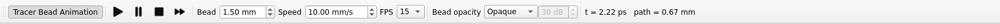

# Tracer-bead animation

`mieworkbench/core/beadanim.py` (`AnimationController` + the pure
`SegmentSet`/`precompute_segments`/`active_positions` model) + the
"Animation" toolbar in `mainwindow.py`.

## What it does

A "bead" is a sphere riding a ray polyline at the physical propagation
speed c/n. The engine records each viz segment's optical path window
(`opl0`/`opl1` = Σn·ds metres at the segment start/end, `rays.vtp` cell
arrays), so the whole animation reduces to one global simulation clock:

```
t0 = opl0 / c,  t1 = opl1 / c
bead active while t0 <= clock < t1
position = lerp(p0, p1, (clock - t0) / (t1 - t0))
```

Children inherit their parent's opl at a split, so a reflected and a
transmitted bead spawn together the instant the parent bead arrives at
the interface — no ray-id/chaining logic needed. Beads inside glass move
slower by 1/n automatically (same geometry, larger opl window).

## Toolbar

**View → Tracer Bead Animation** (also the toolbar's first button) is one
checkable action shared by the menu and toolbar (Qt keeps both in sync).
Enabling it is required before anything else is available — see
**Self-sufficient enable** below for what happens when there's nothing to
animate yet.

- **Play / Pause / Stop / Step** — Stop rewinds every bead to the sources
  at t = 0; Step advances exactly one frame (`speed ÷ fps` mm of vacuum
  path).
- **Bead** (radius, mm), **Speed** (mm/s — "mm of ray path per real
  second for a bead in vacuum"; beads in glass move slower by 1/n), **FPS**
  (5/10/15/24/30).
- **Cap** (`anim_ray_cap`, default 300): max animated rays per source —
  viz segments carry no ray id, so this is a render cap, not a trace cap.
  In the default "off" opacity mode it keeps the first N rays by index;
  in **By power** mode it keeps the **brightest** beads per source
  instead (leading-wavefront beads are always kept, even past the cap —
  see below).
- **Bead opacity**: **Opaque** (default, bit-identical to pre-feature
  behavior) or **By power** — see below.

## Self-sufficient enable

Toggling the enable action on no longer just gates on an overlay already
being loaded. If there's nothing to animate — no segments yet, or the
loaded overlay is stale — enabling generates a fresh ray preview
automatically, using the configured [Ray Preview pattern](#ray-preview-configuration)
(the status bar shows "Generating ray preview…" while it runs). Beads
park **paused at t = 0** the instant the fresh segments land; enabling
never auto-plays. Only when a project isn't open, or a run/preview is
already in flight, does it fall back to the old informational warning.

This also means animation now works out of the box on on-axis
(sequential/Optiland preview) systems: the sequential preview path emits
per-segment optical-path (`opl0`/`opl1`) timing data, so enabling
animation on a scene like `telephoto_zoom` no longer errors "rays predate
timing data" — it just animates. A ray overlay cached from before this
fix (sequential rows with no `opl` columns) still has no timing data;
regenerate it (any manual or auto preview overwrites the cache).

## Ray Preview configuration

All preview settings live in one **Preview Configuration** dialog
(`PreviewConfigDialog`), opened by **Live ray preview…** (Rays toolbar
button) or from **Simulation Settings ▸ Ray Preview** / **Settings ▸
Defaults**. Its sections:

- **Ray pattern** — a **Fan** (rays per source, `fan:n=<K>`) or
  **Rings** (spacing / rays-per-ring / ring count,
  `rings:dr=<mm>:nper=<N>[:nrings=<K>]`) form (`PreviewConfigWidget`).
- **Trace engine** — **Sequential (fast, no reflections)**: the on-axis
  Optiland fast path, exact bead timing, primary transmitted chain only;
  or **Full trace (shows reflections)**: the real Monte-Carlo preview
  subprocess with Fresnel ghost children (6-bounce engine cap, standard
  weak-ray power floor). The default is **Full trace** so reflections
  are visible out of the box; switching to Full trace while extinction
  is Off auto-selects **Logarithmic** extinction (an explicitly chosen
  Linear/Perceptual mode is left alone).
- **Overlay display** — the ray-extinction mode (Off / Linear /
  Perceptual / **Logarithmic (dB)**) with the log mode's dynamic range
  (30/40/60 dB presets or a custom 1–120 dB value) and the opacity
  floor — the same settings as the Extinction toolbar combo and
  **View ▸ Ray Dimming** menu. In log mode a segment R dB below the
  source renders at `opacity = 1 − R/range`: an uncoated-glass ghost
  (~14 dB per reflection) stays clearly visible at 40 dB.
- **Tracer-bead animation** — the bead enable/size/speed/FPS/cap/opacity
  keys (formerly on the Settings "Defaults" tab).
- **Advanced** — the composed `--viz-pattern` spec string, editable and
  kept in sync with the pattern fields both ways; a bare integer is
  shorthand for `fan:n=<int>`, and invalid text shows an inline error
  without disturbing the fields (OK always applies a valid spec).

Pattern **and engine** persist **per document**
(`Project.set_preview_config`/`get_preview_config`, document property
`miewb_preview_config`, travels with the `.FCStd`/`.MieWB`); with no
document config they fall back to this install's last-used values
(QSettings `preview_pattern_spec`/`preview_engine_mode`), then the app
defaults `fan:n=5` / full trace.

## Bead opacity ("By power" mode)

Opt-in; default is always-opaque. In power mode each active bead gets a
per-frame alpha from a frame-normalized log-dB power mapping over a
dynamic range R dB (toolbar spin box, default 30, range 10-60):

```
Pmax  = max absolute `power` among beads ACTIVE THIS FRAME
db    = clamp(10*log10(Pmax / P), 0, R)
alpha = max(1 - db/R, ALPHA_FLOOR)     # ALPHA_FLOOR = 0.08
```

alpha = 1 at P = Pmax and floors at `ALPHA_FLOOR` for
P ≤ Pmax/10^(R/10) — weak beads stay faintly visible rather than
vanishing.

**Leading-wavefront exemption**: beads on "leading" segments render at
alpha = 1.0 regardless of power, for their whole transit. Leading flags
are computed once at overlay load (`compute_leading_flags`) by lineage
reconstruction over the viz segments:

- roots (`opl0 == 0`, source-born) are leading;
- at a split (several children sharing one parent END key), a child
  inherits the parent's leading flag iff its birth power is ≥ 0.9× the
  brightest sibling's power (the **10% sibling rule** — a 50/50 Michelson
  split keeps *both* arms leading; a 90/10 ghost split keeps only the
  90%);
- a non-split continuation always inherits.

`ray_cap` in power mode keeps the **brightest** beads per source (leading
beads always kept, even past the cap) instead of the first-N-by-index
ordering "off" mode uses.

## Gotchas

- Legacy overlays that predate the per-segment `power` array still
  animate; power mode simply falls back to opaque on them.
- The QTimer driving playback never starts under the offscreen test
  platform — `step()`/`_tick()` are callable directly for tests
  (dialog-free-setter idiom).
- The readout shows the simulation clock (auto unit) and the
  vacuum-equivalent optical path c·t travelled so far.
- The dialog's FPS field is a free 1–120 spin box (unlike the toolbar's
  fixed 5/10/15/24/30 combo); an off-list value applies correctly to
  playback but leaves the toolbar's FPS readout unmatched
  (`setCurrentText` is a no-op on that non-editable combo).


