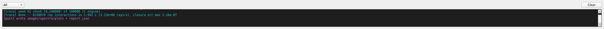

# Console, Python console & Problems

`mieworkbench/panes/console.py` (`ConsolePane`), `py_console.py`
(`PyConsolePane`), `problems.py` (`ProblemsPane`) — three bottom docks,
tabified together.

## Console (pipeline log)

Self-contained: the main window wires `RunController.line(str)` into
`append_line()`; this pane owns all presentation (colorizing, filtering,
scrollback) so it's independently testable and `RunController` stays
Qt-plumbing-only. Every incoming line is kept in an in-memory ring buffer
(last 20000 lines), tagged with a best-effort stage guess from the
line's own prefix:

| Prefix | Stage bucket |
|---|---|
| `[trace]` | trace |
| `[post]` | post |
| `[prep]`/`[setup]`/`[render]`/`[done]` | viz |
| `[optimize]` | optimize |
| anything else | extract (catch-all — extractor/`run_pipeline.py`'s own untagged narration) |

The stage filter combo re-renders the visible text from the ring buffer
without re-running the pipeline. `@MIEWB {...}` progress lines are
consumed entirely by `RunController` (they become `progress()` signal
emissions) — this pane refuses them defensively even if one leaks through
unfiltered.

## Python console

A dependency-free REPL (`code.InteractiveConsole` + a `QPlainTextEdit`
transcript + a `QLineEdit` prompt) whose namespace holds `project` (the
live `core.project.Project` session), `window`, `runner`, and `np`. Power
users can query and mutate the scene programmatically — because every
`Project` mutation flows through its undoable Command path, console edits
get undo/redo for free. Runs synchronously on the Qt main thread (a
long statement blocks the event loop; no data race with the QProcess-based
pipeline runner, which is a separate OS process). Tab completion
(`rlcompleter` over the live namespace) and Up/Down history are built in.
Unit-testable directly: `run_source(text)` + `transcript_text()`.

## Problems

Pre-run validation findings, click-to-locate. **Validate scene** runs
`core.validation.Validator` against the live `Project` + property library
+ the config matrix's current values; **Deep check** additionally runs
FreeCAD-side geometry checks. See
[run-and-validate.md](run-and-validate.md) for the full validation
model — this page is just the dock's presentation: a severity-icon list
(⛔ error / ⚠ warning / ℹ info), double-click to select the offending body.

