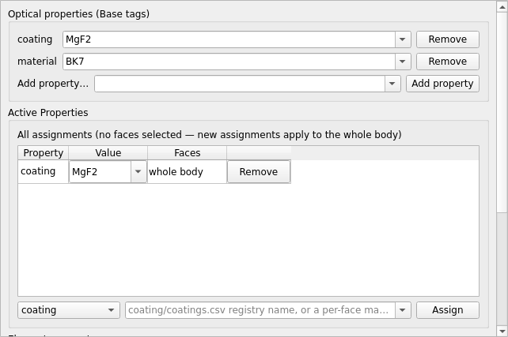

# Element Editor

`mieworkbench/panes/element_editor.py` (`ElementEditorPane`, dock). Never
talks to FreeCAD directly — every edit routes through `Project`.

## What it does

Three sections, each a `QGroupBox`:

### a) Optical properties (Base tags)

One row per non-internal custom property currently on the selected body
(`miewb_*` properties are GUI-internal bookkeeping and are hidden), plus
an **"Add property…"** row fed from `CONTRACT_PROPERTIES` — `material`,
`power`/`lambdac`/`lambdamin`/`lambdamax`/`coherent`/`spectrum`/
`polarization`, `pulse_energy`/`pulse_duration`/`rep_rate`,
`beam_waist`/`m2`/`apodization`, `coating`/`roughness`/`diffuser`/
`scatter`/`filter`, `polarizer`/`polarizer_axis`, `crystal_axis`/
`crystal_axis2`, `grating`/`surface_override`, `mirror`/`absorbance`,
`qe_curve`/`detector_face`, `temperature`. Registry-valued properties
(`material`, `polarizer`, `filter`, `coating`, `grating`, `diffuser`,
`scatter`, `qe_curve`, …) get a combo fed from the loaded optical-property
library. Edits commit on `editingFinished`/toggled/activated →
`project.set_property` (float for numeric contract props, bool for
`coherent`, string otherwise); a per-row **Remove** button →
`project.remove_property`.

### b) Active Properties — per-face assignments

The per-face "facemap" properties — `coating`, `roughness`, `diffuser`,
`scatter`, `grating`, `surface_override` — shown **assignment-centrically**:
one row per (property, value) pair with the face names it covers, not
one row per face. All set arithmetic lives in `core/facemaps.py` (pure,
oracle-tested).

- The **faces** cell opens a checkable per-face menu to add/remove faces
  from that assignment.
- The **value** cell is a registry-fed dropdown with a typed escape hatch
  for values not in the library.
- With a face selection active — fed by `set_face_selection(body, faces)`
  from the [Inspector](inspector.md), or by selecting rows here — the
  table filters to assignments touching the selection.
- **Right-click** (in this table, or in the Inspector's 3D view) opens
  the property → value apply/remove menu tree
  (`build_active_properties_menu`), one submenu per facemap property with
  a checkmark per already-applied value and a **Custom…** entry for a
  typed value. Submenu references are kept alive on
  `menu.property_submenus` (never retrieve a submenu via `QAction.menu()`
  — PySide6 transfers ownership to Python and the GC deletes the
  underlying C++ menu).

### c) Element parameters

The body's parameter-sheet aliases (`project.sheet_for_body`): each row's
raw `"=<num> <unit>"` (or bare `"<num>"`) string is parsed
(`parse_sheet_raw`); the user edits just the number, and
`format_sheet_raw()` recomposes the original prefix/unit verbatim on
commit → `project.set_spreadsheet(...)`. If the body carries a
`miewb_primitive` tag, the edit is followed by
`project.rebuild_primitive(miewb_group's value)` — **rebuild-on-edit**,
not a live constraint expression (see CUSTOMIZE.md §1: topology can
change with a parameter, e.g. a curvature going to zero).

## Multi-body elements

A single-body element edits normally (`set_face_selection` routes it
through the three sections above). A **multi-body element** (or an empty
selection) blanks all three sections instead, via `set_element(element,
bodies)`: a hint line ("Element *Name* — *N* bodies. Pick one to edit
it." or "No element selected.") over a clickable **member list**
(`MemberListWidget`, shared with the [Inspector](inspector.md)). Clicking
a member sub-selects that one body and the editor drops back into its
normal single-body state for it. Face picking for property assignment
(section b) is otherwise unchanged.

## Gotchas

- A sheet param must never live in the body `Placement` —
  `rebuild_element` preserves the pre-rebuild placement, silently
  reverting a placement edit made outside the chain/transform APIs.
- Rebuilds renumber `FaceN`: a preserved face-mapped property (e.g. a
  grating plate's `Face1=...`) can land on a different (even wrong) face
  after a size edit that changes the tessellation. Face indices are only
  trustworthy for the geometry they were authored against.
- `roughness`, `diffuser`, and `scatter` are pairwise mutually exclusive on the same face (deep-rough Beckmann limit) — the Active Properties menu doesn't stop you from combining them by hand; scatter+roughness and scatter+diffuser are engine hard-errors, diffuser+roughness is only GUI-checked. Validate the scene ([run-and-validate.md](run-and-validate.md)) before running.

