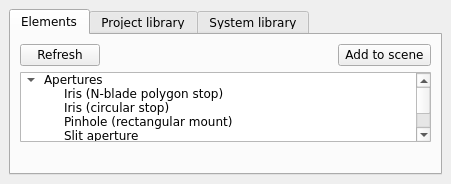

# Library browser + element wizard

`mieworkbench/panes/library.py` (`LibraryPane`, dock "Library") +
`mieworkbench/panes/wizard_dialog.py`/`element_wizard.py` (the add/
customize-element dialog).

## Library pane

Three tabs:

- **Elements** — `primitives/*.FCStd`, grouped by category (Sources,
  Lenses, Mirrors, …). **Refresh** rescans the directory. Double-click or
  **Add to scene** opens the element wizard on the selected primitive
  (`default_label()` computes `kind`, `kind_2`, `kind_3`, … for the
  prefilled label — a pure function, testable without the modal label
  dialog).
- **Project library** — per-category row counts from the *project*
  `PropLibrary` (raw registry reads — a project library may be
  legitimately incomplete/invalid mid-edit, so this never requires a full
  validated load).
- **System library** — same, for the *system* `PropLibrary`.

Both summary tabs' **Open in editor** button and double-clicking a row
open the [Property Library Editor](property-library-editor.md) at that
category.

Two libraries on disk: the **system library** is `<repo>/opticalproperties/`
+ `<repo>/primitives/` (read by default; written only by an explicit,
validated "promote to system" action); the **project library** is
`<project>/opticalproperties/` inside a `.MieWB` workspace — a
possibly-partial copy holding just what a given model actually uses.

## Element wizard (`ElementWizardDialog`)

Every primitive gets a geometry-parameter table prefilled with defaults
(alias / value / unit, tooltips, the `round_flag` convention rendered as
a "Circular shape" checkbox) **and** a device-properties form (source
power/wavelength/polarization/Gaussian beam waist+M²+apodization,
detector reflectivity, optic material/coating/filter/OD…) — the whole
element is configured in one place, not just its dimensions.

- Lens primitives additionally get a **"design by focal length"**
  section (`core.wizards.design_lens`): enter EFL + material (+
  thickness), **Compute** fills the parameter table with the solved
  radii and shows the exact EFL/BFL cross-check.
- **Preview** imports/rebuilds the element live in the 3D view while the
  dialog stays open; Cancel rolls the previewed element back.
- Re-customizing an existing element reuses the same dialog via
  `for_element()`, prefilled from the element's current sheet + body
  properties, with Apply semantics.
- **TypeChooserDialog** is the type-first entry point ("what do you want
  to add?"): pick a role, get a filtered primitive list, then the normal
  wizard opens on the chosen primitive.

## Gotchas

- `property_rows_for()` decides which device properties a primitive
  exposes from its baked `props` (the `.meta.json` sidecar) plus the role
  they imply — full re-editing of any property afterwards is the
  [Element Editor](element-editor.md)'s job, not the wizard's.

