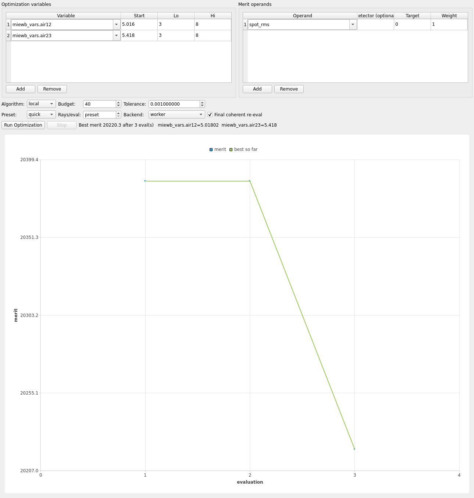

# Optimize

`mieworkbench/panes/optimize_pane.py` (`OptimizePane`, central "Optimize"
tab, also **Simulation → Optimize…**) — full GUI parity with
`scripts/optimize.py`, driven through `core/optimize_controller.py`
(`OptimizeController` owns the `QProcess`; the pane owns none).

## Variable address forms

Every design variable is a spreadsheet cell alias or a train pose field,
in one of three forms (`permute_model.split_var`/`fast_eval` address
grammar, shared by `optimize.py`/`tolerance.py`/the CLI's `--var`):

| Form | Resolves to |
|---|---|
| bare `alias` | the element's own `dim` sheet |
| `sheetlabel.alias` | a named sheet, e.g. `dim_Lens1.ct` |
| `miewb_vars.<name>` | a global variable ([Variables](variables.md)) |
| `train.<ElementLabel>.<field>` | a **chained** element's pose field: `distance`/`decenter_x`/`decenter_y`/`tilt_rx`/`tilt_ry`/`tilt_rz`/`fold_deviation`/`fold_azimuth` (distance+decenter in mm, tilts in degrees) |

The variable-name combo lists `miewb_vars` globals and sheet-qualifies
them automatically (`core.variables.qualify_var_name`); type any other
spreadsheet cell alias by hand for a per-element parameter. Picking a
`miewb_vars` name from the dropdown auto-fills start/bounds from the
sheet's `__min`/`__max` sweep meta when they're real (`vmin < vmax`),
else ±10% of the current value (±0.1 for a zero-valued variable).
**Literal overrides expression**: the start/lo/hi fields are always
concrete numbers even when the sheet cell holds an expression.

## Operands / merits

Operand table columns: operand[@detector] / target / weight.

| Operand | Meaning | Direction | Backend |
|---|---|---|---|
| `spot_rms` / `focus` | detector spot RMS radius (µm), power-weighted per-row when available; combines multiple (source, λ-stratum) rows as the n_rays-weighted RMS | minimize | **sequential** (deterministic Optiland trace) or MC |
| `encircled_energy` | `ee_r80_um` from the coherent field analysis | minimize | sequential (geometric ray-density proxy) or MC (diffraction PSF integral) |
| `mtf50` | `mtf50_tan_cy_mm` from the coherent field analysis | maximize | MC only (needs the coherent field analysis) |
| `detected_power` | summed `total_power_W` over matched detectors | maximize | MC only (needs full MC energy transport) |
| any `raw.merit.key` | a flattened `report.json` key (any string containing `.`) | minimize toward target | MC only |

`@DETECTOR` (optional) restricts an operand to one detector label
(exact match, then unambiguous dotted suffix like `Face5`); default is
every detector in the report (summed for `detected_power`, averaged
otherwise).

Merit = Σ over operands of `weight*(value-target)²` for minimize operands
(and for maximize operands with a nonzero target — "reach this value"); a
pure maximize operand (target 0) contributes `-weight*value`. A failed or
incomplete evaluation is **penalized** (`PENALTY = 1e9`), never fatal.

**Sequential vs MC routing**: `spot_rms`/`focus`/`encircled_energy` *can*
run on the deterministic sequential (Optiland) evaluator — noise-free,
fast. `mtf50`/`detected_power`/raw report keys always need the
Monte-Carlo pipeline. `--eval-backend sequential` only works when every
requested operand is sequential-capable.

## Algorithms

- **local** (default) — scipy Nelder-Mead in normalized [0,1] coordinates
  (so differently-scaled variables condition equally); **promoted to
  `dls`** automatically when the eval backend is `sequential` (a
  deterministic trace makes damped least-squares valid).
- **simplex** — forces Nelder-Mead even on the sequential backend.
- **dls** — damped least-squares (scipy `least_squares`) over the operand
  residuals; sequential backend only.
- **global** — nevergrad CMA-ES; the noisy-MC-path global search.

Inner loop: `fast_eval.Evaluator` with every source patched incoherent
unless an operand needs the coherent field analysis (so the Huygens
gather never runs needlessly). The best design is re-evaluated once at
the end with `keep_coherent=True` for a faithful final number (a
final-eval failure — e.g. the gather's undersampling gate at low ray
budgets — is recorded, never fatal).

## Fidelity / budget settings

Preset (rays/resolution/nlambda defaults), explicit rays/resolution/
nlambda overrides, seeds/seed0, `--eval-backend` (`worker` = persistent
FreeCAD, fast; `full` = fresh-launch reference path; `sequential`), budget
(max evaluations), tolerance (scipy `fatol`), optimizer seed (CMA-ES
RNG).

## Live convergence plot

Fed by `@MIEWB` progress events (stage `optimize`, one event per
evaluation carrying eval/budget/merit/best/params). Uses
`PySide6.QtCharts` when importable, else a dependency-free `QPainter`
line plot — same data API either way. Evaluations with `merit >=
PENALTY_FLOOR (1e8)` are excluded from axis scaling so one failed
candidate can't flatten the plot.

## Failure banner

A styled, word-wrapped, non-modal `QLabel` (hidden by default) surfaces
the first substantive backend error line — matches on the classic
unqualified-variable failure (`alias '...' not found on spreadsheet`),
`PermuteError`, tracebacks, or a generic `Error`/`Exception`/`FAILED`
token pulled up out of the console.

## Config persistence

**Run**/**Stop** aside, the pane's full configuration — variables,
operands, algorithm/budget/fidelity settings — is stashed as JSON on the
`miewb_vars` sheet (`Project.set_optimize_config`/`get_optimize_config`,
document property `miewb_optimize_config`, `{"version":1,"optimize":
cfg}`). It travels with the `.FCStd` (`miewb_tool` packs it verbatim into
`.MieWB`), so reopening a scene re-populates the pane via `apply_config`.
`config()` → `apply_config()` → `config()` round-trips exactly.

*(`camera_triplet`'s shipped config, after the same budget-3 smoke
optimize `scripts/run_demo_equivalence.py`'s gate runs — see
[demo-gallery.md](demo-gallery.md) and
[walkthroughs/camera-triplet.md](walkthroughs/camera-triplet.md).)*
