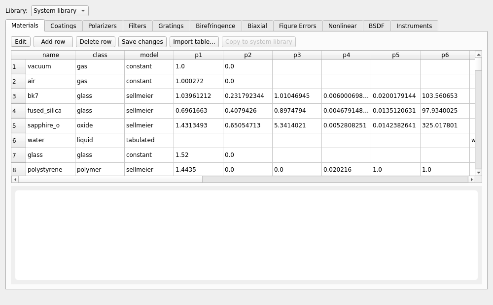

# Property Library Editor

`mieworkbench/panes/prop_editor.py` (`PropEditorPane`) +
`mieworkbench/core/libschema.py` (pure-data column documentation +
advisory validation). Open via **Tools → Property Library Editor…**, or
from the [Library dock](library-browser.md)'s "Open in editor"/
double-click.

## What it does

One `QTabWidget`, one tab per registry — **materials / coatings /
polarizers / filters / gratings / uniaxial / biaxial / figures /
nonlinear / scatter / instruments**. Each tab (`_CategoryEditor`) shows
the registry's rows in a `QTableWidget` with columns = the registry CSV's
own header, so a new column added to a registry shows up here
automatically. A library selector at the top switches every tab between
the **system library** and the **project library** (disabled when no
project root is set).

Three registries with a GUI-picker combo elsewhere have **no tab here**: `qe_curve` → detector/detectors.miedet, `spectrum` → emission/emitters.miesrc, `diffuser` → diffuser/diffusers.miedif. Add/edit those rows by hand-editing the registry file directly (see [file-formats.md](file-formats.md)).

## Editing

Cells are read-only until **Edit** is toggled on. Commit path: gather the
table's current text back into row dicts, refuse if any `reference`
(citation) cell is empty, atomically rewrite the registry CSV
(tmp + `os.replace`), then validate the result through
`PropLibrary.validate()` (the real `load_optical_properties` loader) via
`core.proplib.Transaction`/`validate_and_commit` — **on failure every
touched file is rolled back** and the loader's own error message is
surfaced. This is the one *hard* gate; everything below is advisory.

## Schema tooltips + status line (`core/libschema.py`)

`COLUMN_SCHEMA` documents every column of every registry (description,
units, format); `TABLE_COLUMN_SCHEMA` does the same for the per-row
spectral table files (`nk`/`table`/`table_csv` columns). Hovering a
column header shows its tooltip; the bottom status line updates on
header hover and on cell selection with the same text
(`libschema.status_text`) — empty when nothing applicable, or a distinct
"no schema entry" fallback for a column outside the schema. Content is
distilled from `docs/RAYTRACER.md` §7, the actual loader code
(`optprops.py`/`materials.py` — the loader wins on any conflict with the
docs, since that's what actually runs), and the live registry CSVs; a
drift-proofing test (`test_libschema.py`) checks this module against the
live registries.

Advisory **validators** (`ColumnInfo.validator`) flag likely-wrong cells
before Save: `{"kind": "float", "gt"/"ge"/"range": ...}`,
`{"kind": "int", "gt": ...}`, `{"kind": "enum", "values": (...)}`.
Every validator only fires on a **non-blank** cell — optional columns
are never flagged for being empty (only `reference` has that separate
required-ness rule).

Two registries have irregular shapes the schema documents explicitly:

- **nonlinear** (`nonlinear.mienlo`) — a wide, `kind`-discriminated
  table: one `kind` column selects which of the remaining columns apply
  (a `chi2_tensor` row's `d_il_pm_V` is meaningless on a `saturable`
  row). Full-line `#` comments at the top of the file (documenting the
  `d_il_pm_V`/`r_coeffs_pm_V` packing grammar) are stripped before
  parsing and re-prepended on save.
- **instruments** (`instruments.mieinst`) — wide, `class`-discriminated
  (`camera`/`powermeter`/`spectrometer`/`polarimeter`/`wavefront_sensor`/
  `autocorrelator`); three placeholder classes have hard-validated column
  schemas but no shipped rows yet.

## Spectral table plotting + import

Selecting a row that references a spectral table (`nk_file`/`table`/
`table_csv`) plots it with `PySide6.QtCharts` — no matplotlib anywhere in
the GUI process. **Import table…** maps an arbitrary external CSV's
columns onto the category's required table schema
(`TABLE_SCHEMA`/`CATEGORY_TABS`); the mapping itself is applied by the
free function `apply_column_mapping()`, testable without the (modal)
mapping dialog. Categories whose referenced table shape varies by row
(`instruments`) have no fixed `TABLE_SCHEMA` and so no Import-table
affordance — the chart still plots whatever the selected row's actual
table contains.

## Gotchas

- `Import table…` and the hard commit-time validation are two different
  gates: the schema/validator machinery here is advisory only, so a cell
  can look "clean" in this pane and still fail the real loader on Save
  (e.g. a cross-row consistency rule the advisory validator doesn't
  check).

