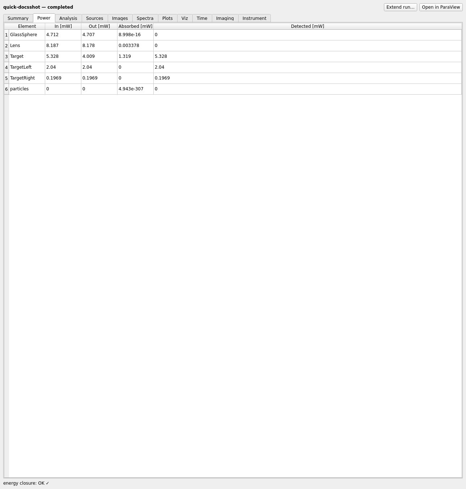
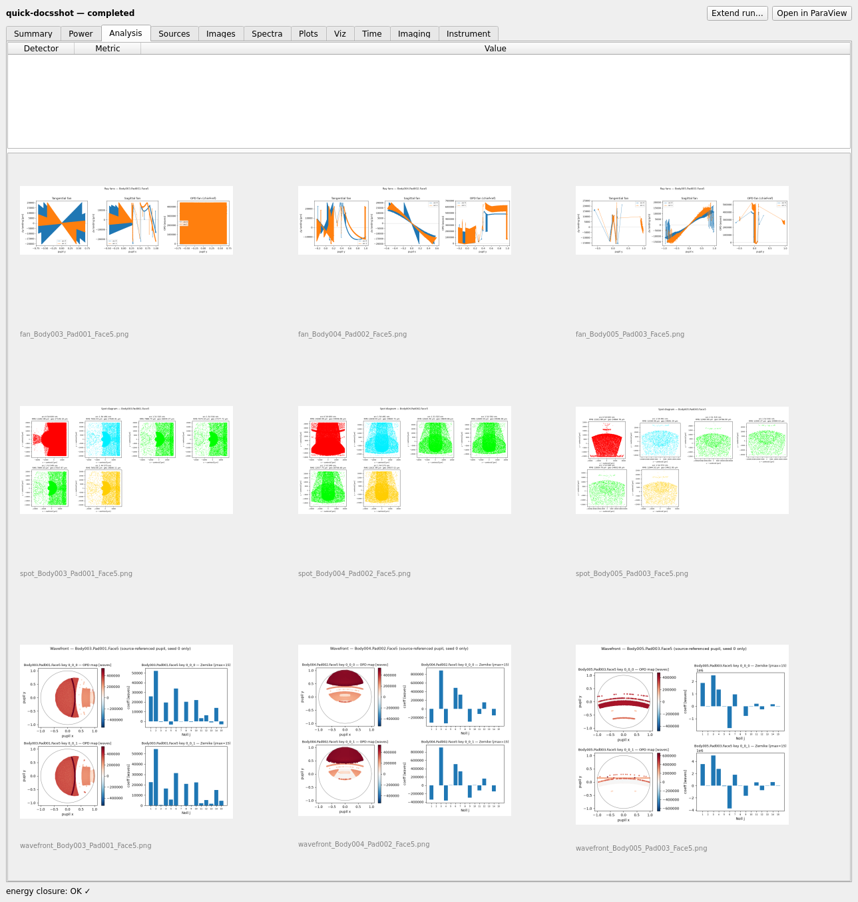

# Results

`mieworkbench/panes/results.py` (`ResultsPane`, central "Results" tab).

## What it does

Browses a completed (or in-progress) case directory
(`results/<model>/<case>/`): `report.json` headline numbers, the
energy-closure audit outcome, and thumbnail galleries of `images/`,
`spectra/`, `plots/`, `viz/`, `imaging/` (the `--image-sim` products).
**Open in ParaView** hands the `.vtp` data to interactive ParaView.

## Tabs

- **Summary** — per-detector power, peak irradiance, pixel size, fringe
  visibility.
- **Power** — per-element energy accounting (In/Out/Absorbed/Detected,
  mW, seed-averaged) via `common.element_power_table` — a diagnostic
  side-table, never a closure bucket.
- **Analysis** — Strehl/RMS/PV wavefront error/MTF50/encircled-energy/
  spot RMS/ghost totals (whatever `report.json`'s optional `analysis`/
  `wavefront`/`ghosts` blocks contain), plus a thumbnail gallery of
  `analysis/*.png` (PSF/MTF/encircled-energy needs `--save-fields`; spot
  diagrams/ray-OPD fans/Zernike maps/ghost tables need
  `--export-rays`/`--ghost-analysis`). Empty on an older case that used
  neither.
- **Sources** — per-(source, detector) detected power.
- **Time** — pulsed-optics/time-domain gallery (pulse/spectrogram/
  streak/cube products).
- **Imaging** — `imaging/image_sim_*.png`, the `--image-sim`
  partial-coherence output.

Every thumbnail/table supports right-click → **Save image as…** /
**Export CSV…**, paired through the same `data/index.csv` convention the
CLI's `--emit-csv` uses (`resolve_data_csv` walks up from the PNG's own
directory looking for the nearest `data/` sibling). Thumbnails open in a
lightbox (arrow keys cycle, Esc closes).

## Chunked-run affordances

Header buttons next to "Open in ParaView":

- **Resume run** — appears for a *dead* case whose
  `cengine/checkpoint.json` says `status='tracing'` (interrupted
  mid-trace, lock free).
- **Extend run…** — appears for a *completed* C-engine case with a
  checkpoint; adds more rays additively.

Both just emit a `case_dir` signal — this pane never launches a
subprocess itself; the main window (via `RunController`) does. This pane
only ever **reads**.

## Monitor mode

Opening a case that is currently locked by a live process shows a
read-only, auto-polling view: a `QTimer` reads `progress.json` + new
images once a second. Editing/rerun affordances are disabled by the main
window, not this pane.

## Gotchas

- Detected power is a diagnostic, not a closure bucket — the energy
  ledger partitions **losses only**, gated at 1e-3. Detector maps are
  unbiased with zero-mean negative MC noise; clip only for display.
- `resolve_data_csv` never raises on a malformed/missing `index.csv` — a
  missing pairing just means "no CSV export available".

