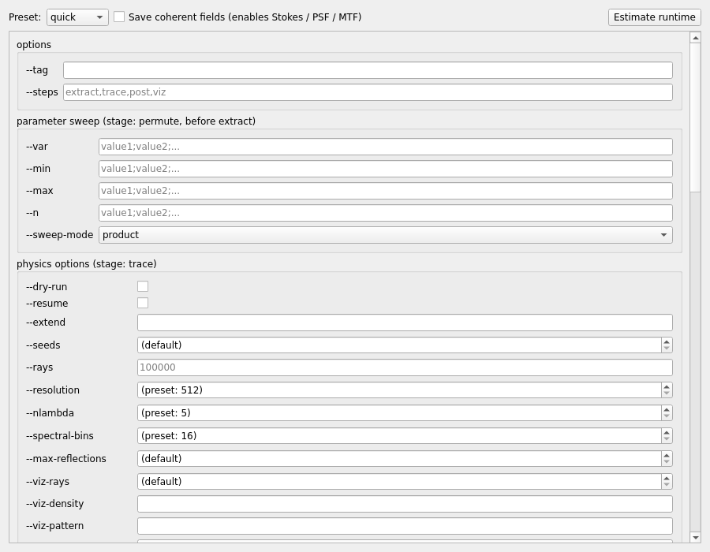

# Run & validate

`mieworkbench/panes/config_matrix.py` (`ConfigMatrix`), `rundialog.py`
(`RunDialog`), `problems.py` (`ProblemsPane`) + `core/validation.py` +
mainwindow's Simulation menu/toolbar (stage-chip progress).

## Configuration matrix

**Simulation → Run Pipeline…** opens a dialog embedding `ConfigMatrix`, a
form **auto-generated from the real CLI**: it introspects
`cli_specs.build_parser("pipeline")` (the same parser `run_pipeline.py`
itself uses) and builds one widget per option, grouped exactly as the
parser's own argument groups — a new `--option` added to
`scripts/cli_specs.py` shows up here with no GUI code to keep in sync.
(`--help`/`--models`/`--print-only` are never rendered; `--preset` gets
its own combo; `--save-fields` is a dedicated, always-visible checkbox
above the rest — "Save coherent fields (enables Stokes/PSF/MTF)".)

Widget-per-action-kind (see `EXCLUDED_DESTS`/the module docstring for the
full rules): `store_true` → checkbox; `choices` → combo (blank first
entry = "unset" when the parser default is `None`); `append` → a
semicolon-separated line edit split into repeated flags; `int` → spin box
(0 = "fall back to preset", `specialValueText` shows what that currently
resolves to); `float`/plain `str` → validated line edit, empty = unset.
`values()` only returns entries that differ from the parser default, so
the form never forwards a flag the pipeline would have picked anyway.

## Pre-run dialog (`RunDialog`)

Shown before **every** launch (owner requirement: always ask). Composes a
read-only summary of the resolved run parameters, `common.estimate()`'s
predicted trace/gather/total wall time (labeled "estimate (calibrated)"
vs. "estimate (uncalibrated fallback)"), accumulator/fields memory
figures, and — for coherent runs — the projected gather pairs and
samples/ray as an M_eff proxy (clearly labeled a projection, not a
measurement). Run/Cancel + "Don't ask again this session"; **Estimate
Runtime** (menu/toolbar/matrix button) reuses the same dialog in an
info-only mode (Close only, no checkbox) so the two surfaces never show
different numbers.

A third mode (`extend_ctx`) reuses the same shell to extend a **completed
C-engine case** additively: a spin box (+x2/x5/x10 presets) for the new
ray total, with a live-recomputed projected additional wall time as it
changes.

Both **Run** and **Dry Run** gate through a Save&Run prompt when the
model has unsaved changes (a run always operates on the last saved file,
never silently auto-saving).

## Dry Run

**Simulation → Dry Run** saves and validates as usual, then launches the
pipeline with `--dry-run`: the trace stage builds its estimates but does
not actually trace; post/viz are skipped. A fast end-to-end sanity check
before committing to a real run.

## Export Run Script

**File → Export Run Script…** packs the current model into a `.MieWB`
and writes a small `chmod +x` POSIX shell script wrapping
`miewb_tool.py run` — a portable job for a machine with just a repo
clone. See [file-formats.md](file-formats.md).

## Validation (Problems pane)

**Validate scene** runs `core.validation.Validator` (pure Python) against
the live `Project`, the active property library, and the current run
configuration: missing tags, bad registry references, inconsistent
per-face maps, etc. **Deep check** additionally runs FreeCAD-side
geometry checks (recompute errors, open solids via OCC, pairwise
overlaps) via the fc-worker's `check` op, and reports success explicitly
on a clean scene (not silent).

Findings are `Finding(severity, message, body, face, fix_hint, check)`
with severity `error`/`warning`/`info`; double-click selects the
offending body. Errors block **Run**; warnings prompt "Run anyway?".
`validationChanged(bool)` (True = has blocking errors) is what the main
window listens to for gating the Run action.

## Progress

Every stage emits `@MIEWB {...}` progress lines
(`MIEWB_PROGRESS=1`, `common.progress_emit`/`parse_progress_line`);
`RunController` (Qt-only `QProcess` wrapper) turns these into `progress`/
`line` signals. The stage chips (extract/trace/post/viz/optimize/
tolerance) in the toolbar/status area color by the live stage; the
[Console](console-and-problems.md) shows the raw log lines.

