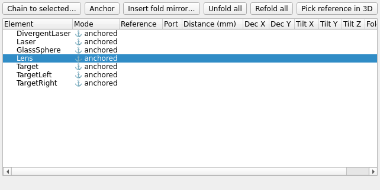

# Optical Train editor

`mieworkbench/panes/train_editor.py` (`TrainEditorPane`, dock).

## What it does

An LDE-style (lens-data-editor) indented tree over the whole optical
train: the main train runs top-to-bottom; a multi-port element
(beamsplitter, fold mirror) sprouts indented per-port child branches; a
fold element carries a checkable "folded" cell. Everything is visible at
once — no per-element sub-dialog required for the common edits.

Every mutation goes through the `Project` train API (`set_chain`,
`set_anchored`, `set_fold_state`, `insert_fold_mirror`, …) — never a raw
property write. See CLAUDE.md's "Optical train / chain model" section for
the underlying storage contract (`MieTrain` dynamic props,
`train_solver.py` as the one solver shared with the headless permuter).

## Reading the tree

- Numeric edge cells (**distance / decenter / tilt**) show the **stored
  expression verbatim**; the evaluated value is appended in parentheses
  for display only, e.g. `gap*2  (= 50.0)`. Editing always edits the bare
  expression.
- **Mode**: anchored (absolute pose) vs. chained (`d` mm down-beam of a
  reference element's port).
- **Port**: the reference element's exit port this element is chained
  onto — `out`/`transmit` (pass-through, never redirects the train, even
  for a tilted/decentered element), `reflect` (the element's actual
  placed mirror plane — the default for pure mirrors), `deviate`
  (explicit `fold_deviation`/`fold_azimuth`, used by gratings/prisms;
  wins as the default port when set).
- **Fold** column: a checkbox with two different meanings depending on
  the row. Checking a *non-fold* row's box is shorthand for marking it a
  fold element (`mark_fold(element, True)`, which also sets
  `folded=True`); once an element **is** a fold, the same box means the
  folded/unfolded **state** (`toggle_fold`). The identity bit and the
  state are deliberately two different controls, reachable separately via
  right-click → "Make fold mirror (unfoldable)" / "Remove fold
  designation".
- **Flip** column: `flip` = beam-side surface is the local exit (the
  "turn the lens around" affordance), via `commit_flip`.

## How to use it

- **Chain to selected**: chains the currently-selected element onto the
  previously-selected one (a small 2-deep selection history tracked
  across tree clicks and external picks). Falls back to the last element
  in solve order when there's no usable selection pair, and refuses with
  a status message (never a silent guess) if even that is ambiguous.
- Right-click a chained row → "Chain onto port…" lists the reference
  element's available ports.
- **Unfold all / Refold all**: unfolding re-collinearizes the downstream
  chain (pass-through frame at the same port origin, so distances keep
  meaning), stashes poses, and tags the fold mirror's bodies
  `miewb_exclude` (ghosted in the 3D view, ignored by the extractor);
  refolding is a bit-exact re-solve.
- Right-click an **anchored** row → "Set absolute pose…" emits
  `editAnchorRequested`, which the main window wires to raise/focus the
  [Position/Orientation panel](transform.md) for that element's primary
  body.
- **Edge-details dialog** (distance row) exposes `rot_order`,
  `pos_rot_order`, `pivot`, and expression-capable `fold_deviation`/
  `fold_azimuth` fields.

## Gotchas

- Distances are **vertex-to-vertex along the beam** (exit vertex → entry
  vertex), not center-to-center.
- Errors from the Project API surface in a bottom status label, never a
  modal — offscreen tests must never block on this pane.
- All expression cells here use `train_solver.EXPR_HELP`'s grammar (same
  as [Variables](variables.md)) — degrees-native trig.

