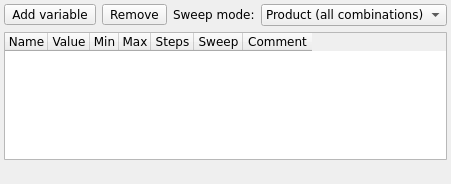

# Variables

`mieworkbench/panes/variables_pane.py` (`VariablesPane`, dock) over
`mieworkbench/core/variables.py` (Qt-free sheet model) and the
`miewb_vars` `Spreadsheet::Sheet`.

## What it does

A table editor for global sweep variables, mirroring the
[Train Editor](train-editor.md)'s idioms: every mutation goes through the
`Project` API (`ensure_variables_sheet`/`apply_variable_cells`) — never a
raw cell/property write; the **Value** column shows the stored expression
verbatim with the evaluated value appended in parentheses for display
(`gap*2  (= 50.0)`); errors surface in a bottom status label, never a
modal.

Columns: Name, Value, Min, Max, Steps, Sweep (enabled?), Comment.

## Expression grammar (`train_solver.EXPR_HELP`)

Numbers, variables, `+ - * / ( )`, the constant `pi`, and functions `sin
cos tan asin acos atan atan2 sqrt abs radians degrees` — **trig is
DEGREES-native** (`sin(30) == 0.5`; `asin` returns degrees). Radian
variants `sinr/cosr/tanr/asinr/acosr/atanr/atan2r` are also available.
This is the one grammar used everywhere an expression is accepted:
variable cells here, train-editor edge cells, and float body properties
via `miewb_expr_<prop>`.

Cross-references are cycle-checked (the full reference path is named in
the error). Editing a variable rebuilds every primitive whose `dim` sheet
references `miewb_vars` (`Project.apply_variable_cells` in the GUI,
`permute_model.extend_touched_for_miewb_vars` headless).

## Name rules (`validate_name`)

Must match `^[A-Za-z_][A-Za-z0-9_]*$`; must not look like a spreadsheet
cell address (`R1`, `A2`, `ab12` — FreeCAD hard-rejects those as
aliases); must not contain `__` (reserved for the `__min`/`__max`/`__n`/
`__on` meta-suffix columns) and must not collide with a meta suffix.

## Addressing a global variable elsewhere

A bare name in a `dim` sheet expression is looked up on that element's
own sheet; to reference a global `miewb_vars` value, qualify it:
`=<<miewb_vars>>.name * 1mm` (the `* 1mm` is required — FreeCAD's own
expression engine, not this grammar, evaluates `dim` cells). From
`optimize`/`tolerance`/sweep specs, `core.variables.qualify_var_name`
does this automatically: a bare name that is a known `miewb_vars` key is
emitted `miewb_vars.<name>`; anything already containing a `.`, or not a
known global, passes through unchanged (a free-typed `dim`-sheet alias).

## Sweeps

Each variable has independent `min`/`max`/`n`/`enabled` sweep meta.
**Product** mode runs every combination of enabled variables; **zip**
mode advances them in lockstep (`common.sweep_combos` is the one
combination-order authority, shared with the CLI's `--sweep-mode`). A
pre-sweep summary dialog always shows before a sweep launches.

## Gotchas

- Sheet-qualification errors from an unqualified global (`alias 'gap' not
  found on spreadsheet 'dim'`) are the classic mistake this pane and
  `qualify_var_name` exist to prevent — but a variable name typed
  directly into the [Optimize](optimize.md)/[Tolerance](tolerance.md)
  panes' name combos is only auto-qualified when it's chosen from the
  dropdown (a known global); free-typed names are taken literally.

