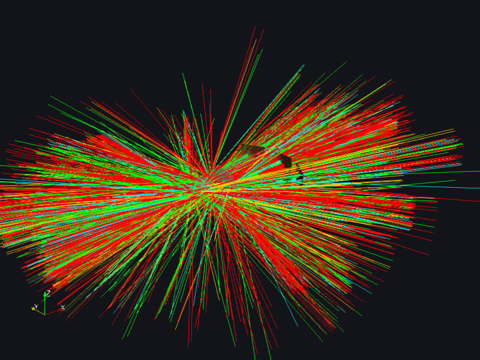

# 3D Viewport

`mieworkbench/panes/scene3d.py` (central "3D View" tab) +
`mieworkbench/widgets/vtkview.py` (`VtkSceneView`, shared with the
Inspector pane) + `mieworkbench/widgets/faceindicators.py`.

## What it does

Renders every body in the current `Project` in one VTK render window.
Body-local face STLs are body-local metres; the scene renders in metres
so ray/detector `.vtp` overlays (also metres) line up without rescaling.
Placement = one shared `vtkTransform` per body (translation = pos_mm ×
1e-3, rotation from the same quaternion convention `core/transforms.py`
uses — the two can never drift apart).

**Role coloring** (`role_for_body`): a body is a *source* when it carries
both `power` and `lambdac` custom properties, a *detector* when
`material == "detector"`, else an *optic*. Sources render red-ish and
fully lit; detectors gray-blue translucent; optics glassy light-blue
translucent. A selected face highlights solid orange on just that face's
actor.

## How to use it

- **Fit** resets the camera to frame the whole scene; **+X/-X/+Y/+Z**
  toolbar buttons snap to an axis-aligned view.
- **Click** a face to select it — `Scene3DPane` only selects whole
  *elements* (the hit body highlights in full); face-level selection for
  editing lives in the [Inspector](inspector.md), not here.
  - **Shift+click** extends the selection (adds without removing).
  - **Ctrl+click** toggles one face's membership.
  - A plain click on empty space clears the selection; a modified
    (Shift/Ctrl) click on empty space leaves it untouched.
- **Rays** toggle button shows/hides the loaded ray overlay
  (`results/viz/rays.vtp`); if nothing is loaded yet, checking it emits
  `raysPreviewRequested` (the orchestrator runs one).
- **View → Face Orientation Indicators**: red half-disc = source
  emit-face / detector detect-face; blue dot = optic body-local +x face;
  green dot = aperture (slit/iris/pinhole) body-local +x face. Visual
  only, never traced — uses tessellation-time `normal_hint`
  (FreeCAD's `normalAt()`), **not** the physics contract's
  `orientation_outward`.
- **Scale bar**: adaptive mm/µm bottom-right overlay, toggleable via
  `set_scale_bar_visible`.
- **Train ghosting**: excluded bodies (an unfolded fold mirror's
  bodies, `miewb_exclude`) render with a distinct ghosted style
  (`set_excluded_bodies`).
- **Chain/fold linkage lines**: dotted lines between chained/folded
  elements' port origins (`set_chain_links`) — a click on a linkage line
  resolves through the same picker as a face pick
  (`widgets/facepicker.py`).
- **Stale overlay**: after a geometry edit invalidates the loaded ray
  preview, the ray actors grey out (`set_overlay_stale`) until a fresh
  preview lands.

## Gotchas

- This pane and the [Inspector](inspector.md) share the exact same
  `VtkSceneView` widget class but serve different jobs: this one shows
  the *whole scene* and only ever selects elements; the Inspector shows
  *one body* and is where per-face selections for the Element Editor are
  actually built.
- Building the widget never touches the GPU (offscreen-safe for tests);
  only `Initialize()`/`Render()` do real OpenGL work, which crashes under
  Qt's `offscreen` platform plugin. `grab()`ing this widget under
  `QT_QPA_PLATFORM=offscreen` may return a black image — see
  [../../scripts/tools/capture_docs_screenshots.py](../../scripts/tools/capture_docs_screenshots.py)'s
  notes.

*(a ParaView `overview3d` render of a traced scene — the GUI's own
[Results](results.md) "Open in ParaView" path uses the same renderer;
the live VTK widget itself grabs blank under Qt's offscreen platform
plugin, so screenshots of this pane are captured this way rather than
via a direct widget grab — see the capture tool's module docstring.)*
