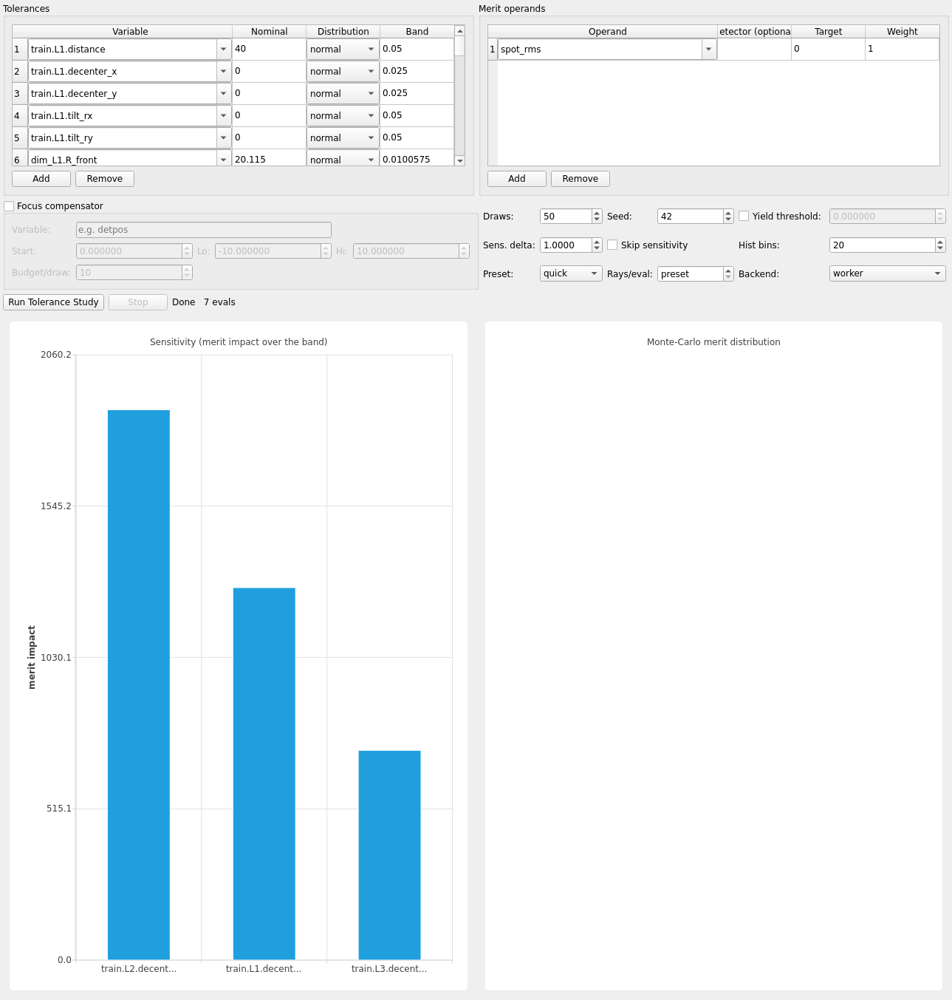

# Walkthrough: camera_triplet

A real photographic objective — a Cooke triplet (~50 mm EFL, published
prescription rescaled), iris stop ~f/5.6, 36×24 mm sensor, white-light
scene (450–650 nm) — chained as an optical train (source → L1 → L2 →
Stop → L3 → Sensor). Demonstrates the [Optimize](../optimize.md)/
[Tolerance](../tolerance.md) panes end to end, including an honest
non-textbook result.

## Load

```bash
env/bin/python -m mieworkbench demos/camera_triplet.MieWB
```

(or **File → Open** in a running session). The scene opens with the
[Train Editor](../train-editor.md) showing the chained L1/L2/Stop/L3/
Sensor sequence and the [Variables](../variables.md) dock populated with
`air12`/`air23` (the two air gaps) among the demo's globals.

## What ships pre-configured

Opening the demo auto-populates both panes from configs baked into the
`.FCStd` (`Project.get_optimize_config`/`get_tolerance_config`,
`scripts/make_demos.py`) — nothing has been *run* yet:

- **Optimize**: variables `miewb_vars.air12` (start 5.016, bounds
  3–8 mm) and `miewb_vars.air23` (start 5.418, bounds 3–8 mm); operand
  `spot_rms:0:1` (minimize); algorithm `local`, budget 40, tolerance
  0.001. The eval backend resolves to the deterministic **sequential**
  (Optiland) path — `spot_rms` is sequential-capable and airspace-only
  variables need no 3D MC trace, so this run is fast and noise-free
  (the pane's Backend combo itself only lists worker/full and does not
  reflect this — the actual routing is automatic, see
  [optimize.md](../optimize.md)).
- **Tolerance**: 29 rows spanning every chained element (`L1`, `L2`,
  `Stop`, `L3`, `Sensor`) — despace, decenter, tilt (mirrors/lenses/
  apertures/detectors per the demo's `auto_tolerances()` conventions) —
  plus each lens's `R_front`/`R_back`/`ct` radius and thickness rows;
  same `spot_rms:0:1` operand; 50 Monte-Carlo draws, seed 42.


## Run a short optimize

Click **Run Optimization**. At the default budget (40 evals, sequential
backend) this finishes in well under a minute. The screenshot above is
from the *same* study run at budget 3 — the equivalence gate's smoke
check (`scripts/run_demo_equivalence.py`'s `SMOKE_BUDGET`) — showing a
real 3-point convergence series (merit ~20386 → ~20220) rather than a
converged optimum; running the full budget 40 in the GUI converges
further and reports the best `air12`/`air23` pair in the status line.

## Run tolerance sensitivity

Click **Run Tolerance Study**. The full 29-row table now runs end to end
(variant-scratch-directory names past ~140 chars are hash-shortened,
`common.shorten_variant` — landed after an earlier round hit the
filesystem's 255-char name limit on studies this size). Uncheck **Skip
sensitivity** is already off by default, so the sensitivity pass runs
first regardless of the Monte-Carlo draw count. The gate itself smoke-runs
only a 3-row subset (`L1`/`L2`/`L3` decenter_x) for speed — the screenshot
below is that subset.



## Interpret the result

The *idealized* Cooke-triplet lesson is that the **middle element's
(L2) decenter dominates** the sensitivity ranking — it sits at the
system's most convergent bundle. The captured run above does show that
ranking (`L2 > L1 > L3` by merit impact). **Do not expect this to
reproduce reliably**: the as-built, **broadband** (450–650 nm) triplet is
aberration/stray-ray limited, and its geometric `spot_rms` merit is
unstable — a handful of far-landing rays can dominate the RMS at typical
ray counts, so a different seed or ray budget can just as easily rank L1
or L3 highest, or show L2 as *least* sensitive. `demos/README.md`'s
"Optimization & tolerancing" section documents this explicitly: the gate
reports the ranking rather than asserting it. A monochromatic (re-)
corrected triplet, or a wavefront/encircled-energy merit instead of
geometric `spot_rms`, would be needed to reproduce the textbook result
reliably — this instability is itself the lesson about merit choice.

See also: [demo-gallery.md](../demo-gallery.md),
[optimize.md](../optimize.md), [tolerance.md](../tolerance.md).
