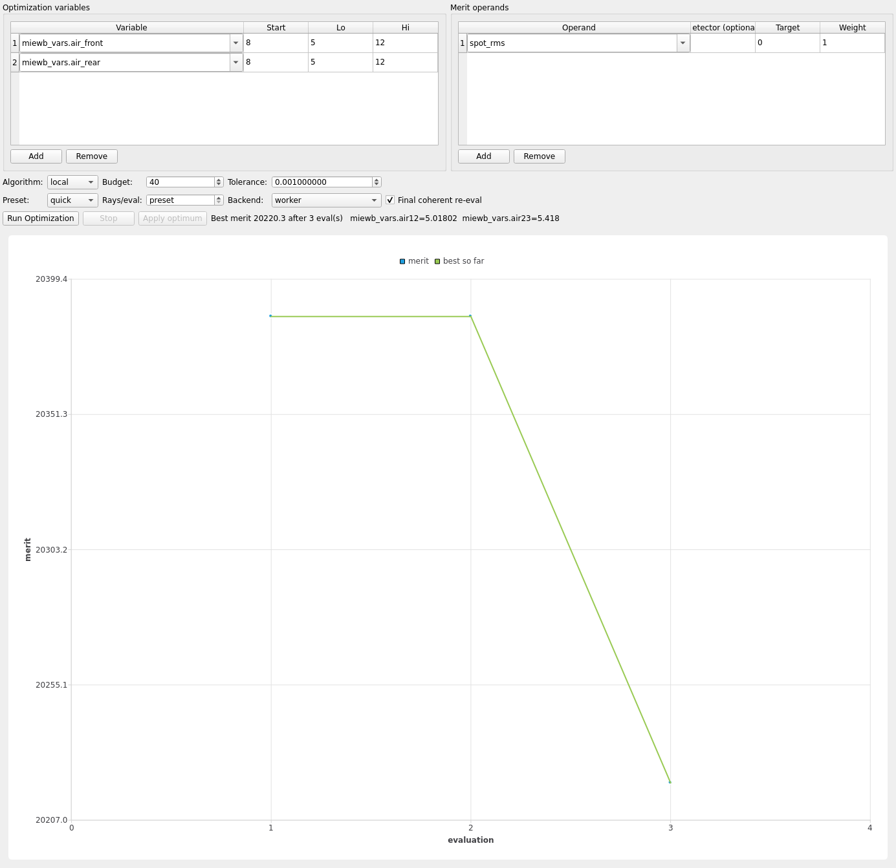

# Walkthrough: double_gauss

A symmetric six-element double-Gauss-form objective (~53 mm focus,
f/2.6): outer positive meniscus (`L1`) + cemented BK7/SF5 achromat
(`D1`), iris stop, second cemented achromat (`D2`) + outer meniscus
(`L4`), white-light scene (486–656 nm). The canonical four-group
double-Gauss stack, built through the chain. Demonstrates a **sequential**
optimize study (like camera_triplet) but a much larger tolerance table
(the whole point of the variant-name hashing fix).

## Load

```bash
env/bin/python -m mieworkbench demos/double_gauss.MieWB
```

Chain: `L1 → D1 → Stop → D2 → L4 → Sensor`, symmetric about the stop.

## What ships pre-configured

- **Optimize**: two variables, `miewb_vars.air_front` (start 8 mm,
  bounds 5–12) and `miewb_vars.air_rear` (start 8 mm, bounds 5–12) — the
  two central airspaces flanking the stop; operand `spot_rms:0:1`;
  algorithm `local`, budget 40. Eval backend resolves to **sequential**
  (airspace-only variables, spot_rms-capable), same fast/noise-free path
  as camera_triplet.
- **Tolerance**: **42 rows** — every chained element (`L1`, `D1`, `Stop`,
  `D2`, `L4`, `Sensor`) despace/decenter/tilt, plus each lens/doublet's
  radii and (for the cemented doublets `D1`/`D2`) both `ct_crown`/
  `ct_flint` thickness rows; same `spot_rms:0:1` operand, 50 draws.



## Run a short optimize

Click **Run Optimization**. Sequential + airspace-only variables keeps
this as fast as camera_triplet's — expect a converged `air_front`/
`air_rear` pair well within budget 40's default wall time.

## Run tolerance sensitivity

Click **Run Tolerance Study**. At 42 rows this is the **largest** shipped
tolerance table of the four showcase demos — exactly the case
`common.shorten_variant`'s hash-shortening (landed in the variant-name-
hashing round, after 15+ row studies previously hit the filesystem's
255-char scratch-directory name limit, `Errno 36`) makes practical: the
full sensitivity pass now runs end to end instead of erroring out
partway through.

## Interpret the result

The story is **symmetry-breaking decenters dominate** a fast,
near-symmetric objective: a double-Gauss form is deliberately
front-back symmetric about the stop to cancel odd aberrations (coma,
distortion) to first order — that cancellation depends on the two halves
staying co-axial. A lateral decenter on any one element (`D1`/`D2`
especially, being the fastest/most curved surfaces) breaks that symmetry
directly, so decenter rows should rank well above the equivalent despace
or tilt rows for the same element, and well above the outer menisci
(`L1`/`L4`, further from the stop and less steeply curved). Contrast with
camera_triplet: here the merit-sensitivity story follows directly from
the design's own symmetry, not from a stray-ray artifact, so it is
expected to reproduce consistently.

See also: [demo-gallery.md](../demo-gallery.md),
[optimize.md](../optimize.md), [tolerance.md](../tolerance.md).
