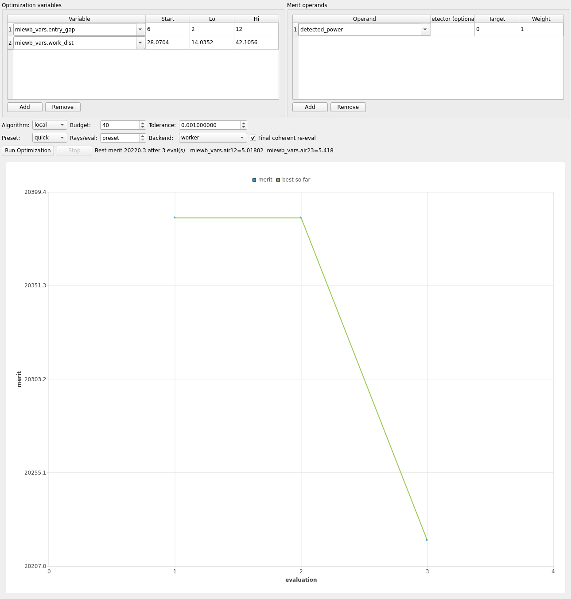

# Walkthrough: fiber_coupling_doublet

660 nm collimated laser → cemented BK7/SF5 f=30 achromat doublet (f/5.6,
NA≈0.09) → 200 µm / 0.22 NA step-index fiber → exit detector. Demonstrates
optimizing/tolerancing a **`detected_power` (throughput)** merit instead
of `spot_rms` — the operand every other showcase demo uses.

## Load

```bash
env/bin/python -m mieworkbench demos/fiber_coupling_doublet.MieWB
```

Chain: `Doublet → Fiber (entry face) → Coupled (exit detector)`.

## What ships pre-configured

- **Optimize**: two variables, `miewb_vars.entry_gap` (start 6 mm,
  bounds 2–12) and `miewb_vars.work_dist` (start ≈28.07 mm, bounds
  ≈14.04–42.11) — the collimator-to-doublet gap and the doublet-to-fiber
  working distance; operand **`detected_power:0:1`** (maximize — a
  nonzero target of 0 means "reach as high as possible", see
  [optimize.md](../optimize.md)'s operand table). Eval backend is
  **worker** (MC): `detected_power` always needs the full Monte-Carlo
  energy transport (TIR guiding down the fiber core, per
  `demos/README.md`'s `fiber_coupler` note on the sibling demo) — there
  is no sequential path for this operand.
- **Tolerance**: 16 rows — `Doublet` despace/decenter/tilt + its radii/
  `ct_crown`/`ct_flint`, `Fiber` despace/decenter, `Coupled` despace/
  decenter; same `detected_power:0:1` operand, 50 draws.



## Run a short optimize

Click **Run Optimization**. Every evaluation is a real MC trace of the
TIR-guided fiber path (~tens of bounces down the core), so expect this to
run noticeably slower per-eval than either sequential-backend showcase
(camera_triplet, double_gauss) — comparable in cost to
schmidt_cassegrain's worker-backend study.

## Run tolerance sensitivity

Click **Run Tolerance Study**. 16 rows is a middling size; runs to
completion well within the variant-name-hashing fix's headroom.

## Interpret the result

The story is **lateral decenter kills coupling far faster than the same
despace**: fiber coupling efficiency is set by how well the doublet's
converging cone overlaps the fiber core's acceptance cone (NA≈0.09 into
0.22 NA) — a decenter directly walks the focused spot off the core
(a ~100 µm core radius has essentially zero tolerance budget for a
lateral miss), while a despace of the same magnitude only defocuses the
spot slightly larger, still largely landing on the core. Expect
`Doublet.decenter_x`/`decenter_y` and `Fiber.decenter_x`/`decenter_y` to
dominate the sensitivity ranking, well above `Doublet.distance`/
`Fiber.distance` (despace) and the tilt/radius/thickness rows. This
mirrors real fiber-coupled instrument builds, where lateral alignment is
the tight tolerance and axial position is comparatively forgiving.

See also: [demo-gallery.md](../demo-gallery.md),
[optimize.md](../optimize.md), [tolerance.md](../tolerance.md).
