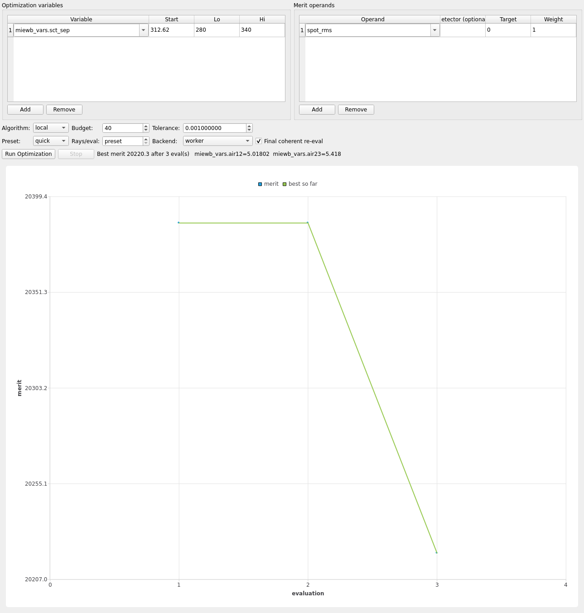

# Walkthrough: schmidt_cassegrain

A C8-class 203 mm f/10 catadioptric: quartic Schmidt corrector (hand-
authored asphere), perforated spherical primary (R 812.8), spherical
secondary (R 231.07), white-light star, folded back through the primary's
hole to focus. Demonstrates a **worker (Monte-Carlo)**-backend optimize
study and a despace/tilt-focused tolerance table.

## Load

```bash
env/bin/python -m mieworkbench demos/schmidt_cassegrain.MieWB
```

The chained train runs Corrector → Primary (`reflect` port) → Secondary
(`reflect` port) → Focus, folding the beam back through the primary's
central perforation.

## What ships pre-configured

- **Optimize**: one variable, `miewb_vars.sct_sep` (start 312.62 mm,
  bounds 280–340 mm) — the primary→secondary separation; operand
  `spot_rms:0:1`; algorithm `local`, budget 40. Eval backend resolves to
  **worker** (MC): unlike an airspace-only refractive system, the
  catadioptric fold means the sequential Optiland path cannot serve this
  operand end to end, so every evaluation is a real Monte-Carlo trace at
  the `quick` preset's ray count — noisier and slower per-eval than
  camera_triplet's sequential study.
- **Tolerance**: 9 rows — `Primary` distance/tilt_rx/tilt_ry, `Secondary`
  distance/tilt_rx/tilt_ry, `Focus` distance/decenter_x/decenter_y; same
  `spot_rms:0:1` operand, 50 MC draws.



## Run a short optimize

Click **Run Optimization**. Because every evaluation is a real MC trace,
expect each eval to take noticeably longer than camera_triplet's
sequential study, and expect visible noise in the convergence plot from
run to run — `sct_sep` moves the secondary's focus position, so the
merit landscape itself is fairly smooth, but the *measured* `spot_rms` at
each candidate carries the usual MC statistical spread.

## Run tolerance sensitivity

Click **Run Tolerance Study**. 9 rows is small enough to run to
completion quickly even at the default 50 Monte-Carlo draws.

## Interpret the result

The story here is the **secondary mirror's despace-to-focus
magnification**: in a Cassegrain-type fold, a small change in
primary-to-secondary separation is amplified by the secondary's
convergence ratio into a much larger shift of the final focus position —
so `Secondary.distance` should rank high in the sensitivity table, well
above the primary's own distance/tilt terms (the primary is closer to
the pupil and less magnified by the fold). `Secondary.tilt_rx`/`tilt_ry`
are also expected to matter more than the primary's tilts for the same
reason. `demos/README.md` frames this demo's story without camera_
triplet's reproducibility caveat — the despace-to-focus amplification is
a real geometric-optics effect, not a stray-ray artifact, so it should
rank consistently across seeds/ray counts even though every individual
evaluation is still a noisy MC trace.

See also: [demo-gallery.md](../demo-gallery.md),
[optimize.md](../optimize.md), [tolerance.md](../tolerance.md).
